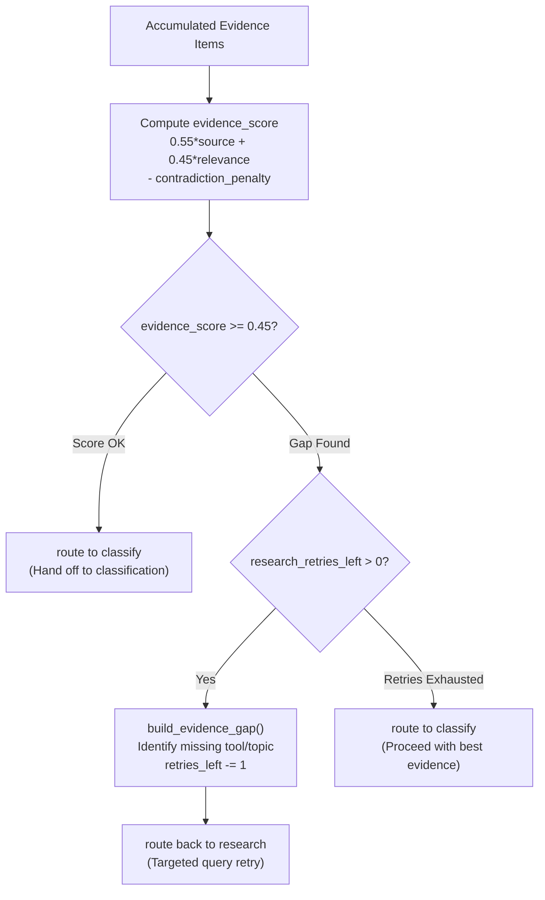

# ASSESS Node

- **File:** [layers/analysis/nodes/assess.py](../../../../../layers/analysis/nodes/assess.py) ([assess_node](../../../../../layers/analysis/nodes/assess.py#L72))
- **Type:** Deterministic (no LLM)
- **Runs:** After every RESEARCH run

## Purpose

Deterministic evidence quality scorer. Computes a numerical score from the accumulated evidence using a weighted formula, and decides whether RESEARCH has gathered enough to hand off to CLASSIFY. If not, writes an EvidenceGap that tells RESEARCH exactly what is missing and which tool to use next.

## Quality Assessment & Gap Routing



## How It Works

### Evidence Score Formula

```
evidence_score = (0.55 * source_score) + (0.45 * relevance_ratio) - contradiction_penalty

source_score      = min(pubmed_count * 0.4 + other_count * 0.15, 1.0)
relevance_ratio   = sum(relevance_score for relevant items) / (len(evidence) * 10)
contradiction_penalty = min(contradictory_count * 0.15, 0.4)
```

- `pubmed_count`: Number of PubMed results in evidence
- `other_count`: All other sources (DDG, Semantic Scholar, CrossRef)
- `relevance_score`: 1-10 field set by RESEARCH LLM per item
- `contradictory`: Items where `contradicts_harm=True`

Score is clamped to `[0.0, 1.0]`.

### Routing Decision

If `evidence_score >= EVIDENCE_THRESHOLD (0.45)` OR `research_retries_left <= 0` -> route to `classify`.

Otherwise -> build `EvidenceGap` and route back to `research`.

### Gap Builder Logic ([build_evidence_gap](../../../../../layers/analysis/nodes/assess.py#L37))

The gap builder inspects the current state to generate a specific targeted gap:

| Situation | Gap Reason | Suggested Tool |
|---|---|---|
| No PubMed results at all | `zero_pubmed_results` | `pubmed_search` |
| PubMed found, but none relevant | `low_relevance` | `semantic_scholar_search` |
| Some relevant evidence, but thin | `thin_evidence` | `duckduckgo_search` |

The `suggested_query` uses `harm_hypothesis` (clinical terminology) as the base, falling back to `search_context`.

## Input State Fields Read

| Field | Source |
|---|---|
| `evidence` | RESEARCH accumulator |
| `harm_hypothesis` | RESEARCH |
| `search_context` | OBSERVE |
| `research_retries_left` | State |

## Output State Fields Written

| Field | Value |
|---|---|
| `evidence_score` | Float [0.0, 1.0] |
| `evidence_gap` | EvidenceGap dict (if score < threshold and retries left) |
| `research_retries_left` | Decremented by 1 (if retrying) |
