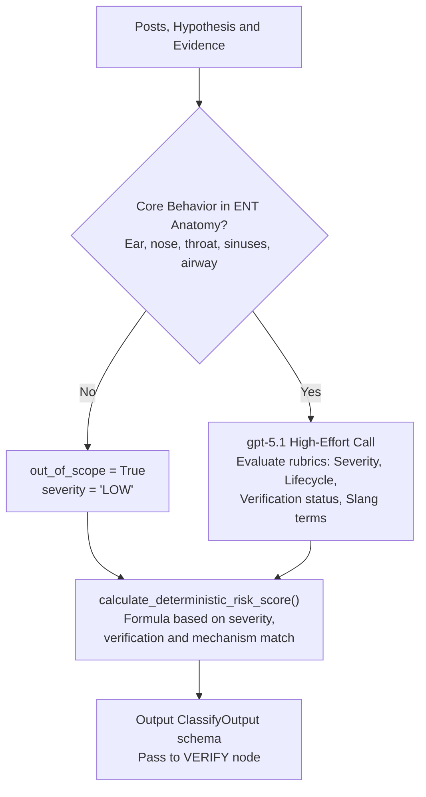

# CLASSIFY Node

- **File:** [layers/analysis/nodes/classify.py](../../../../../layers/analysis/nodes/classify.py) ([classify_node](../../../../../layers/analysis/nodes/classify.py#L223))
- **Model:** gpt-5.1 (reasoning_effort="medium")
- **Type:** LLM
- **Runs:** After ASSESS (and on retry from VERIFY if label is inconsistent)

## Purpose

Single high-effort LLM call that produces the full risk classification for a cluster. Given the cluster's posts, harm hypothesis, and gathered evidence, outputs the severity label, risk score, lifecycle stage, verification status, slang terms, and reasoning.

## Classification Architecture

## How It Works

A single structured LLM call with the full `ClassifyOutput` schema.

### Severity Rubric (from system prompt)

Before rating severity, the LLM checks: does the core behavior involve the ear canal, tympanic membrane, nasal cavity/sinuses, throat/pharynx, tonsils/adenoids, or auditory system? If no -> `severity=LOW`, `out_of_scope=True`.

| Label | Anchor |
|---|---|
| `HIGH` | Plausible immediate physical harm requiring emergency care if replicated (e.g. eardrum perforation, home surgical procedures on infants, airway obstruction) |
| `MODERATE` | Plausible harm requiring medical follow-up but not immediately life-threatening (e.g. unsupervised piercing, non-sterile substance in ear canal) |
| `LOW` | Educational/informational content, or behavior with minimal plausible harm |

### Verification Rubric

| Status | Anchor |
|---|---|
| `CONFIRMED` | At least one cited source documents this exact behavior OR the same injury mechanism. Must be clinical/peer-reviewed, top professional medical website, reputable news article, or explicit professional medical advice |
| `PROVISIONAL` | Related but doesn't document the specific mechanism, or source is a casual blog/lifestyle magazine |
| `INSUFFICIENT_EVIDENCE` | No meaningful supporting evidence found |

**Critical rule:** Casual blogs and unverified social media posts cannot justify `CONFIRMED`. They support `PROVISIONAL` at most.

### Lifecycle Stages

**Trend vs Isolated Incident threshold:** Minimum 5 distinct posts AND at least 2 distinct platforms to qualify as a trend. If not met -> `lifecycle="Isolated incident"`.

| Stage | Criteria |
|---|---|
| `Emergence` | Meets minimum threshold, still accelerating, < 7 days since first detected |
| `Growth` | Sustained/increasing velocity, 7+ days |
| `Resurfacing` | Previously tracked trend with > 14 day gap then new activity |
| `Declining` | Post velocity dropping for 3+ consecutive check intervals |
| `Latent` | Still present but very low and stable volume |
| `Isolated incident` | Does not meet 5-post / 2-platform minimum |

### Supporting Evidence IDs

The LLM must cite which specific evidence items support the `verification` rating using `"pmid:<number>"` for PubMed or the URL for web sources. Empty list if `INSUFFICIENT_EVIDENCE`.

## Output Fields

| Field | Type | Description |
|---|---|---|
| `label` | `HIGH` / `MODERATE` / `LOW` | Risk severity |
| `risk_score` | float 0.0-1.0 | Numerical risk confidence |
| `lifecycle` | Lifecycle stage string | Trend lifecycle stage |
| `verification` | Verification status string | Evidence backing |
| `supporting_evidence_ids` | list[str] | PMIDs or URLs justifying verification |
| `slang_terms` | list[str] | Hashtags and alternative names |
| `mechanism_level_match` | bool | Whether clinical evidence directly matches mechanism |
| `out_of_scope` | bool | True if behavior is outside ENT anatomy |
| `reasoning` | str | Full classification rationale |

## Input State Fields Read

| Field | Source |
|---|---|
| `posts` | OBSERVE |
| `search_context` | OBSERVE |
| `harm_hypothesis` | RESEARCH |
| `evidence` | RESEARCH accumulator |
| `matched_trend_id` | OBSERVE (for known-trend context) |
| `db_trend_label` | OBSERVE DB match |
| `db_trend_lifecycle` | OBSERVE DB match |

## Output State Fields Written

| Field | Value |
|---|---|
| `label` | Risk label |
| `risk_score` | Float |
| `lifecycle` | Lifecycle stage |
| `verification` | Verification status |
| `supporting_evidence_ids` | List of PMIDs/URLs |
| `slang_terms` | Hashtag/name list |
| `mechanism_level_match` | Bool |
| `out_of_scope` | Bool |
| `reasoning` | Rationale string |
| `citations` | Evidence items cited |
| `low_confidence` | True if LLM fell back to defaults |
