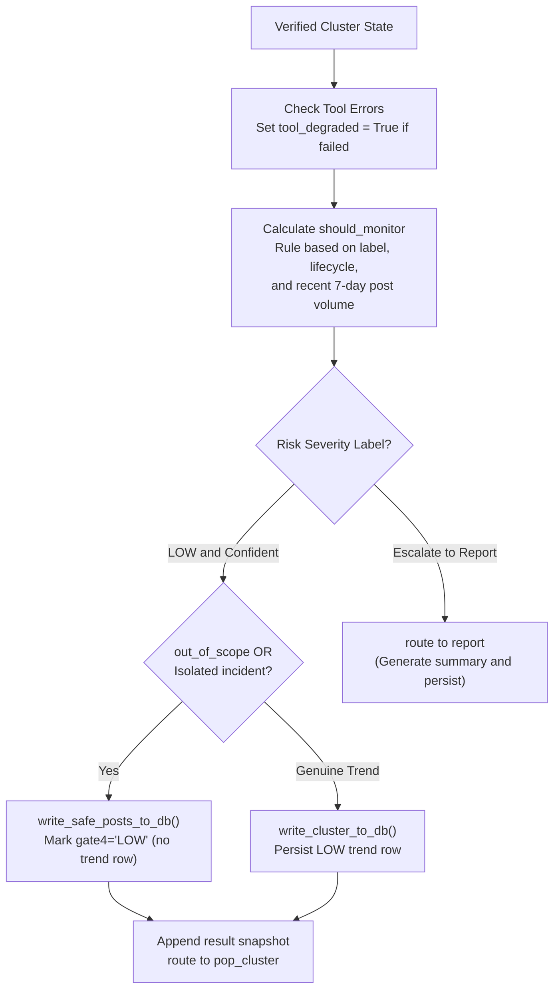

# DECIDE Node

- **File:** [layers/analysis/nodes/decide.py](../../../../../layers/analysis/nodes/decide.py) ([decide_node](../../../../../layers/analysis/nodes/decide.py#L13))
- **Type:** Deterministic (no LLM)
- **Runs:** After VERIFY (or after verify_router in the low_confidence path)

## Purpose

Final deterministic gate. Sets the tool_degraded flag, handles DB writes for LOW-risk clusters, computes the should_monitor flag for velocity monitoring scheduling, and routes to REPORT (HIGH/MODERATE) or back to pop_cluster (LOW + confident).

## Decision & Persistence Flow



## How It Works

### 1. tool_degraded Flag

Set to `True` if any `tool_errors` were recorded during the run, or if `verify_finding.citation_check_failed=True`. This is surfaced in the REPORT and signals that the classification may be incomplete.

### 2. LOW Cluster Handling

If `label == "LOW"` AND `low_confidence == False`:

- If `out_of_scope=True` OR `lifecycle == "Isolated incident"`: calls `write_safe_posts_to_db()` (marks posts `gate4_category='LOW'`, no trends row written).
- Otherwise (a genuine LOW trend): calls `write_cluster_to_db()` to write the trend row with label LOW.

The cluster snapshot is appended to `cluster_results`.

### 3. should_monitor (Velocity Scheduling Rule)

The `should_monitor` flag controls whether the Velocity Monitor layer picks up this trend for active growth tracking:

```python
should_monitor = (
  label == "HIGH"
  or (label == "MODERATE" and (
    lifecycle in ("Emergence", "Growth", "Resurfacing")
    or recent_post_count >= 7
  ))
  or (label == "LOW" and lifecycle in ("Emergence", "Growth") and post_count > 50)
)
```

`recent_post_count` = posts in the last 7 days for this trend (fetched via [get_recent_post_count()](../../../../../layers/analysis/db/queries.py#L43)).

## Routing (via [decide_router](../../../../../layers/analysis/core/routing.py#L82))

| Condition | Next Node |
|---|---|
| `label == "LOW"` AND `low_confidence == False` | `pop_cluster` |
| Any other case (HIGH, MODERATE, LOW+low_confidence) | `report` |

## Input State Fields Read

| Field | Source |
|---|---|
| `label` | CLASSIFY |
| `tool_errors` | Accumulator |
| `verify_finding` | VERIFY |
| `low_confidence` | VERIFY |
| `lifecycle` | CLASSIFY |
| `out_of_scope` | CLASSIFY |
| `posts` | OBSERVE |
| `cluster_id` | pop_cluster |

## Output State Fields Written

| Field | Value |
|---|---|
| `tool_degraded` | Bool |
| `should_monitor` | Bool |
| `cluster_results` | Appended (for LOW clusters handled here) |

## DB Calls

| Function | Operation | Target Table |
|---|---|---|
| [write_cluster_to_db()](../../../../../layers/analysis/db/queries.py#L255) | LOW trend (not isolated, not out_of_scope) | `trends` + `posts` |
| [write_safe_posts_to_db()](../../../../../layers/analysis/db/queries.py#L485) | LOW isolated/out_of_scope | `posts` only |
| [get_recent_post_count()](../../../../../layers/analysis/db/queries.py#L43) | Always (for should_monitor calculation) | `posts` |
