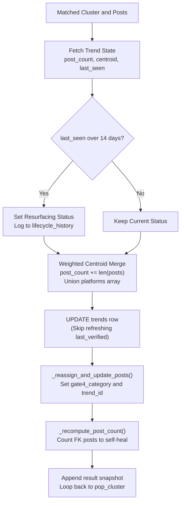

# merge_known Helper

- **File:** [layers/analysis/core/graph.py](../../../../../layers/analysis/core/graph.py) ([merge_known_node](../../../../../layers/analysis/core/graph.py#L131))
- **DB Function:** [layers/analysis/db/queries.py](../../../../../layers/analysis/db/queries.py) ([merge_posts_into_trend](../../../../../layers/analysis/db/queries.py#L389))
- **Role:** Fast-Path Database Bypass Helper (zero LLM, zero external tools)
- **Type:** Deterministic helper function
- **Runs:** Fast path for known trends with fresh verdicts and no new evidence

> [!NOTE]
> **Database Helper vs. Pipeline Node:** `merge_known` is defined directly in [layers/analysis/core/graph.py](../../../../../layers/analysis/core/graph.py) rather than `layers/analysis/nodes/`. It is registered with LangGraph via `graph.add_node("merge_known", merge_known_node)` to serve as a fast-path bypass for known trends, updating post counts and vector centroids in PostgreSQL without invoking any LLM or external search tool.

## Purpose

Merges new posts into an existing, already-classified trend without any LLM calls. This is the fast path that skips the entire RESEARCH -> ASSESS -> CLASSIFY -> VERIFY -> REPORT pipeline for clusters that are clearly just adding new volume to a well-understood, recently-verified trend.

## Execution Flow



## How It Works

Calls [merge_posts_into_trend(trend_id, posts, new_centroid=centroid)](../../../../../layers/analysis/db/queries.py#L389) which performs all of the following atomically:

1. **Post count increment**: `post_count = post_count + len(posts)`
2. **Platform merge**: Merges new platform list into existing JSONB array using set union
3. **Weighted centroid merge**: Updates the trend's centroid as a weighted average:
   ```
   merged = (old_centroid * old_count + new_centroid * new_count) / total_count
   ```
   Result is L2-normalized.
4. **Resurfacing detection**: If `last_seen_at` was more than 14 days ago, sets `lifecycle_status = "Resurfacing"`
5. **Lifecycle history log**: Appends a `post_update` event to `lifecycle_history` JSONB array
6. **Post reassignment**: Calls `_reassign_and_update_posts()` to update each post's `gate4_category` and `linked_trend_id`
7. **Post count self-heal**: Recomputes `post_count` from the actual FK count to prevent drift

After `merge_posts_into_trend()`, a minimal state snapshot is built (with `abstract`, `label`, `risk_score`, `lifecycle`) and appended to `cluster_results`. Then the graph loops back to `pop_cluster`.

Note: `merge_known_node` intentionally does NOT refresh `last_verified_at`. This is by design: the verdict freshness clock (VERDICT_TTL_DAYS=30) should only reset after a full LLM reclassification, not a fast merge.

## Routing

Always returns to `pop_cluster`.

## Input State Fields Read

| Field | Source |
|---|---|
| `matched_trend_id` | OBSERVE DB match |
| `posts` | OBSERVE cluster |
| `centroid` | OBSERVE cluster |
| `cluster_results` | Accumulator |

## Output State Fields Written

| Field | Value |
|---|---|
| `cluster_results` | Appended with merge snapshot |

## DB Calls

| Function | Operation |
|---|---|
| [merge_posts_into_trend()](../../../../../layers/analysis/db/queries.py#L389) | UPDATE trends + posts (full merge logic) |
