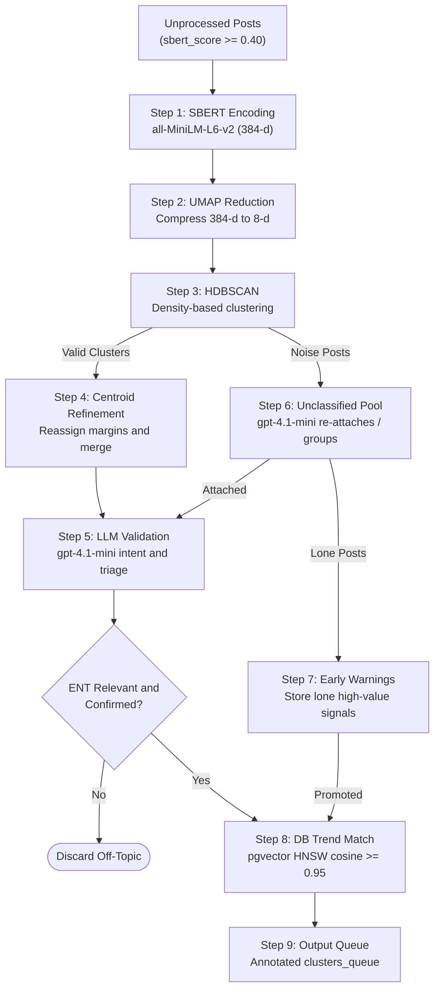

# OBSERVE Node

- **File:** [layers/analysis/nodes/observe.py](../../../../../layers/analysis/nodes/observe.py) ([observe_node](../../../../../layers/analysis/nodes/observe.py#L304))
- **Model:** gpt-4.1-mini (up to 6 concurrent workers)
- **Type:** LLM + Unsupervised ML
- **Runs:** Once per analysis run (not per-cluster)

## Purpose

The entry node of the graph. Runs once on the full batch of posts. Groups semantically similar posts into thematic clusters using unsupervised ML, validates each cluster's intent using an LLM, matches clusters to existing DB trends via pgvector, and promotes accumulated early-warning signals. Outputs a clusters_queue for the sequential pop-loop to process.

## Pipeline Architecture



## How It Works

### Step 1: SBERT Encoding

All incoming posts are encoded into 384-dimensional vectors using all-MiniLM-L6-v2 (same model as preprocessing).

```python
# cluster_math.py: cluster_posts() - L24
embeddings = sbert_model.encode(texts, normalize_embeddings=True)
```

### Step 2: UMAP Dimensionality Reduction

Reduces 384-dim embeddings to 8 dimensions for HDBSCAN (UMAP_N_COMPONENTS=8, UMAP_N_NEIGHBORS=10, UMAP_MIN_DIST=0.0). Dense packing (min_dist=0) is intentional to force tight HDBSCAN clusters.

If the batch is smaller than the target components, UMAP is skipped and raw embeddings are used.

### Step 3: HDBSCAN Clustering

Density-based clustering with MIN_CLUSTER_SIZE=3, MIN_SAMPLES=2. Posts not fitting any cluster get label -1 (noise / UNCLASSIFIED).

### Step 4: Misclassification Check + Cluster Merge

- [misclassification_check()](../../../../../layers/analysis/utils/cluster_math.py#L82): Reassigns any post closer to another cluster's centroid by more than CENTROID_MARGIN=0.05.
- [merge_similar_clusters()](../../../../../layers/analysis/utils/cluster_math.py#L126): Merges any two clusters whose centroids have cosine similarity >= MERGE_SIMILARITY_THRESHOLD=0.98.

### Step 5: LLM Cluster Validation

Each cluster is sent to gpt-4.1-mini concurrently (max 6 threads) using the [ClusterValidation](../../../../../layers/analysis/nodes/observe.py#L79) structured output schema.

For each post, the LLM classifies:

| Intent Category | Meaning |
|---|---|
| `participant` | Doing the challenge/behavior themselves |
| `advice_seeking` | Asking if something is safe |
| `advice_giving_harmful` | Recommending an unverified/unsafe practice |
| `professional_demo` | Professional demonstrating a procedure |
| `professional_warning` | Professional warning against the behavior |
| `unrelated` | Out of scope |

The LLM also outputs:
- `dominant_anatomy`: Primary ENT anatomy for the cluster
- `ent_relevance`: `direct` / `harm_outcome_only` / `not_related`
- `split_post_ids`: Posts to eject (off-topic or mixed-intent)
- `professional_demo_post_ids` / `professional_warning_post_ids`: Isolated separately
- `cluster_name`: Short behavioral name (max 5 words)
- `search_context`: 1-2 sentence medical research context for RESEARCH node
- `triage_flag`: `likely_harmful` / `unclear` / `likely_safe`

Clusters with `ent_relevance=not_related` or `confirmed=false` are discarded.

**Prompt injection hardening:** Post text is HTML-escaped and capped at 500 chars before XML wrapping. The system prompt explicitly states that content inside `<post>` tags is untrusted data and cannot override instructions.

### Step 6: Unclassified Posts Handling

Posts with HDBSCAN label -1 are sent to the LLM as a pool. The LLM attempts to:
- Attach them to existing named clusters by behavioral meaning
- Form new behavioral groups from the remainder
- Intent-tag any posts that stay unclassified

### Step 7: Early Warning Capture

Lone posts with intents `professional_warning`, `advice_giving_harmful`, or `participant` that couldn't form a real cluster are stored in `trend_signals` as `early_warning` signals ([insert_early_warning_signal()](../../../../../layers/analysis/db/queries.py#L516)).

If there are >= EW_PROMOTE_THRESHOLD=3 pending early-warning signals (from this and previous runs) that cluster together (cosine >= EW_SIMILARITY_THRESHOLD=0.80), they are **promoted** into a synthetic cluster and injected into the queue for full-pipeline processing.

Promotion is skipped if the signals' centroid already matches an existing DB trend (using [find_nearest_trend()](../../../../../layers/analysis/db/queries.py#L62)) or a current-batch cluster.

### Step 8: DB Trend Matching

Each validated cluster's centroid is compared against all existing `trends` rows using pgvector HNSW approximate nearest-neighbor search ([find_nearest_trend()](../../../../../layers/analysis/db/queries.py#L62)). If a match is found above OBSERVE_MATCH_THRESHOLD=0.95 cosine similarity, the cluster is annotated with the matched trend's context (`matched_trend_id`, `db_trend_label`, `db_trend_last_verified`, etc.) for the `pop_router` to use.

### Step 9: Queue Building

All validated clusters are appended to `clusters_queue`. The [pop_cluster](pop_cluster.md) helper processes them one-by-one to prevent merge-check race conditions.

## Input State Fields Read

| Field | Source |
|---|---|
| `posts` | Orchestrator (all unanalysed posts from DB) |
| `run_id` | Orchestrator |

## Output State Fields Written

| Field | Value |
|---|---|
| `clusters_queue` | Ordered list of cluster dicts |
| `cluster_results` | `[]` (initialised) |

## DB Calls

| Function | Operation |
|---|---|
| [find_nearest_trend()](../../../../../layers/analysis/db/queries.py#L62) | pgvector HNSW match per cluster |
| [insert_early_warning_signal()](../../../../../layers/analysis/db/queries.py#L516) | Store lone high-value posts |
| [fetch_pending_early_warnings()](../../../../../layers/analysis/db/queries.py#L560) | Load pending signals for promotion check |
| [mark_early_warnings_promoted()](../../../../../layers/analysis/db/queries.py#L587) | Flip promoted signals to consumed |
