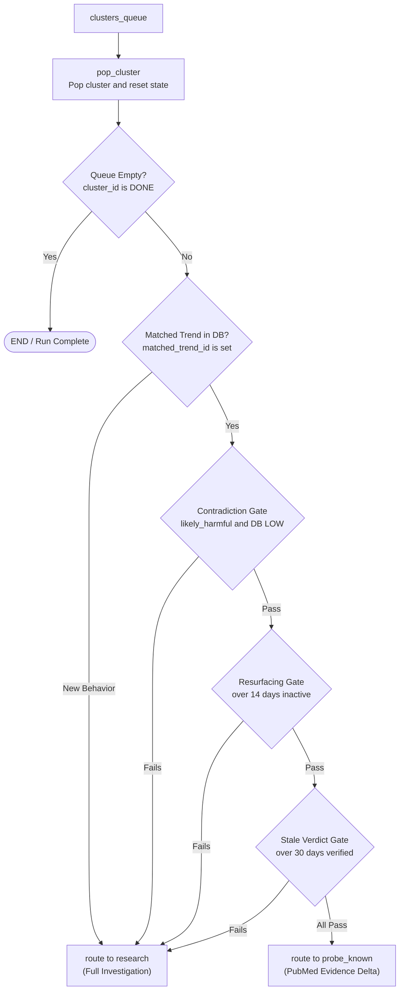

# pop_cluster Helper

- **File:** [layers/analysis/core/graph.py](../../../../../layers/analysis/core/graph.py) ([pop_cluster_node](../../../../../layers/analysis/core/graph.py#L170))
- **Role:** Graph Orchestration & Queue Iterator (no LLM, no external tools)
- **Type:** Deterministic helper function
- **Runs:** Once per cluster, at the start and end of each loop iteration

> [!NOTE]
> **Orchestration Helper vs. Pipeline Node:** `pop_cluster` is defined directly in [layers/analysis/core/graph.py](../../../../../layers/analysis/core/graph.py) rather than `layers/analysis/nodes/`. It is registered with LangGraph via `graph.add_node("pop_cluster", pop_cluster_node)` solely to control the processing loop, performing in-memory queue management and resetting state accumulators.

## Purpose

Manages the sequential cluster processing queue. Pops the next cluster from `clusters_queue`, resets all per-cluster accumulators in state, and immediately routes to either the fast-path ([probe_known](probe.md)) or the full pipeline ([research](research.md)) based on whether the cluster matches an existing DB trend and whether that trend's stored verdict is trustworthy.

## Queue & Routing Architecture

## How It Works

### Queue Pop ([pop_cluster_node](../../../../../layers/analysis/core/graph.py#L170))

Removes the first cluster from `clusters_queue` and unpacks its fields into the active-cluster slots of `AgentState`. If the queue is empty, sets `cluster_id = "DONE"`.

All research/classification accumulators are zeroed out so the new cluster starts fresh:
- `search_queries = []`
- `evidence = []`
- `evidence_score = 0.0`
- `label = None`
- `citations = []`
- `reasoning = ""`
- `research_retries_left = 3`
- `verify_retries_left = 3`

### Routing Logic ([route_after_pop](../../../../../layers/analysis/core/graph.py#L247))

If `cluster_id == "DONE"` -> `END`.

If `matched_trend_id is None` (brand new behavior) -> `research`.

If `matched_trend_id` is set, three freshness gates are checked. If **any** fail, the full pipeline is forced:

| Gate | Condition to force full pipeline |
|---|---|
| **Contradiction** | `triage_flag == "likely_harmful"` AND `db_trend_label == "LOW"` |
| **Resurfacing** | Days since `db_trend_last_seen` > RESURFACE_GAP_DAYS (14) AND lifecycle != "Emergence" |
| **Stale verdict** | Days since `db_trend_last_verified` > VERDICT_TTL_DAYS (30) OR `last_verified` is None |

If all three gates pass -> `probe_known` (evidence-delta check before fast-path merge).

## Input State Fields Read

| Field | Source |
|---|---|
| `clusters_queue` | Set by OBSERVE |
| `matched_trend_id` | Set by OBSERVE DB match |
| `triage_flag` | Set by OBSERVE LLM validation |
| `db_trend_label` | Set by OBSERVE DB match |
| `db_trend_last_seen` | Set by OBSERVE DB match |
| `db_trend_last_verified` | Set by OBSERVE DB match |
| `db_trend_lifecycle` | Set by OBSERVE DB match |

## Output State Fields Written

| Field | Value |
|---|---|
| `cluster_id` | Active cluster ID (or "DONE") |
| `posts` | Posts for this cluster |
| `trend_name` | Working cluster name |
| `search_context` | Medical search context |
| `centroid` | Cluster embedding vector |
| `matched_trend_id` | Preserved from OBSERVE |
| `db_trend_label` | Preserved from OBSERVE |
| `db_trend_risk_score` | Preserved from OBSERVE |
| `db_trend_last_verified` | Preserved from OBSERVE |
| `db_trend_lifecycle` | Preserved from OBSERVE |
| `research_retries_left` | Reset to 3 |
| `verify_retries_left` | Reset to 3 |
| `search_queries` | Reset to `[]` |
| `evidence` | Reset to `[]` |
| `evidence_score` | Reset to 0.0 |
| `label` | Reset to None |
| `citations` | Reset to `[]` |
| `reasoning` | Reset to `""` |
