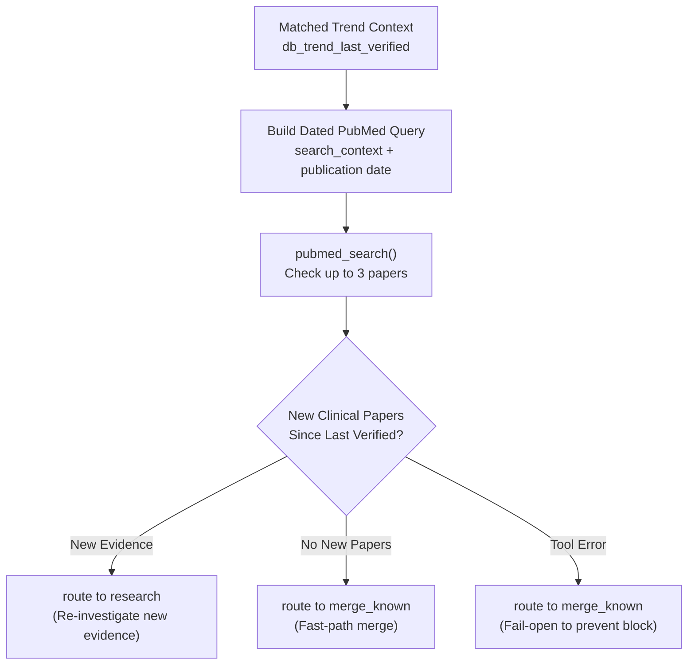

# probe_known Node

- **File:** [layers/analysis/nodes/probe.py](../../../../../layers/analysis/nodes/probe.py) ([probe_known](../../../../../layers/analysis/nodes/probe.py#L32))
- **Type:** Pipeline Tool Node (NCBI PubMed Integration, no LLM)
- **Tool Dependency:** [pubmed_search](../../../../../layers/analysis/tools/pubmed.py#L69)
- **Runs:** For known trends that pass all pop_router freshness gates

> [!NOTE]
> **Tool Integration Node vs. Graph Helpers:** Unlike `pop_cluster` and `merge_known` (which are internal loop and DB helpers in `layers/analysis/core/graph.py`), `probe_known` resides in its own module inside `layers/analysis/nodes/probe.py` because it actively queries an external medical literature database ([PubMed](../../../../../layers/analysis/tools/pubmed.py)) over HTTP, evaluating literature freshness before deciding whether to merge or escalate.

## Purpose

A cheap evidence-delta check that guards the fast-path merge. Before allowing new posts to be silently merged into an existing known trend, PROBE checks whether any new PubMed publications have appeared since the trend was last fully verified. If new evidence exists, the cluster is escalated to the full pipeline ([research](research.md)). If not, it proceeds to [merge_known](merge.md). Tool errors fail open to MERGE to avoid blocking the pipeline.

## Decision Flow



## How It Works

1. Gets the search context (`search_context` or `trend_name`) for the matched trend.
2. Appends a PubMed date filter to restrict results to publications since `db_trend_last_verified`:
   ```
   "cotton swab ear perforation" AND ("2026/01/01"[Date - Publication] : "3000"[Date - Publication])
   ```
3. Calls [pubmed_search(dated_query, max_results=PROBE_MAX_RESULTS)](../../../../../layers/analysis/tools/pubmed.py#L69).
4. If any results are returned -> escalate to `research`.
5. If no results, or if the PubMed call fails -> proceed to `merge_known`.

Missing search context also fails open to `merge_known`.

## Routing

| Condition | Next Node |
|---|---|
| New PubMed papers found since `last_verified_at` | `research` |
| No new papers | `merge_known` |
| PubMed tool failure or no search context | `merge_known` (fail open) |

## Input State Fields Read

| Field | Source |
|---|---|
| `matched_trend_id` | OBSERVE DB match |
| `search_context` | OBSERVE LLM validation |
| `trend_name` | OBSERVE LLM validation |
| `db_trend_last_verified` | OBSERVE DB match |

## Constants

| Constant | Value | Purpose |
|---|---|---|
| PROBE_MAX_RESULTS | `3` | Existence check only; one new paper is enough to escalate |
