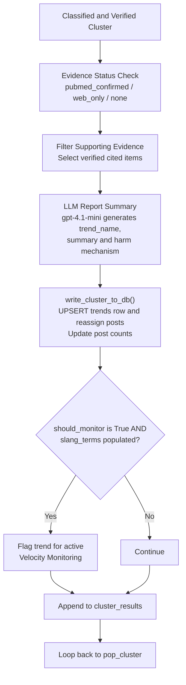

# REPORT Node

- **File:** [layers/analysis/nodes/report.py](../../../../../layers/analysis/nodes/report.py) ([report_node](../../../../../layers/analysis/nodes/report.py#L44))
- **Model:** gpt-4.1-mini
- **Type:** LLM + DB write
- **Runs:** For HIGH, MODERATE, and LOW+low_confidence clusters only

## Purpose

Generates a short structured clinical summary of the classified trend and persists the full cluster to the database. This is the final node in the full pipeline before looping back to pop_cluster.

## Report & Persistence Architecture



## How It Works

### Step 1: Evidence Status

Determines one of three statuses from the evidence accumulator:
- `pubmed_confirmed`: At least one relevant PubMed paper found
- `web_only`: No PubMed, but web sources found
- `no_literature_found`: Empty evidence

### Step 2: Supporting Evidence Selection

Selects the subset of evidence items whose IDs or titles appear in `supporting_evidence_ids` (from CLASSIFY), filtering out contradicting items. Falls back to all relevant non-contradicting items if CLASSIFY didn't populate this field.

### Step 3: LLM Summary Generation

Single `gpt-4.1-mini` call with the `ReportSummary` schema:

```python
class ReportSummary(BaseModel):
    trend_name: str     # short behavioral name
    summary: str        # 2-3 sentence plain-English description
    harm_mechanism: str # 1 sentence: why harmful to pediatric ENT health
    key_evidence: list[str]  # ["Paper 1 (PMID: ...)", "Source 2"]
```

**Critical instruction in the prompt:** "Ensure the summary and harm mechanism ONLY describe the exact behaviors mentioned in the provided Key evidence and classification reasoning. Do not pull in unrelated clinical terms or behaviors."

On LLM failure, a minimal fallback report is generated without any LLM call.

### Step 4: DB Persistence

Calls [write_cluster_to_db(eff_state, centroid=centroid)](../../../../../layers/analysis/db/queries.py#L255) which performs the full UPSERT into `trends` and reassigns all posts. This is the point where HIGH and MODERATE trends are written to the database.

If `should_monitor=True` and `slang_terms` are populated, the trend is flagged for velocity monitoring.

## Input State Fields Read

| Field | Source |
|---|---|
| `cluster_id` | pop_cluster |
| `label` | CLASSIFY |
| `risk_score` | CLASSIFY |
| `evidence` | RESEARCH |
| `supporting_evidence_ids` | CLASSIFY |
| `reasoning` | CLASSIFY |
| `should_monitor` | DECIDE |
| `slang_terms` | CLASSIFY |
| `centroid` | OBSERVE |
| `cluster_results` | Accumulator |

## Output State Fields Written

| Field | Value |
|---|---|
| `cluster_results` | Appended with full cluster summary |

## DB Calls

| Function | Operation |
|---|---|
| [write_cluster_to_db()](../../../../../layers/analysis/db/queries.py#L255) | `trends` + `posts` |
