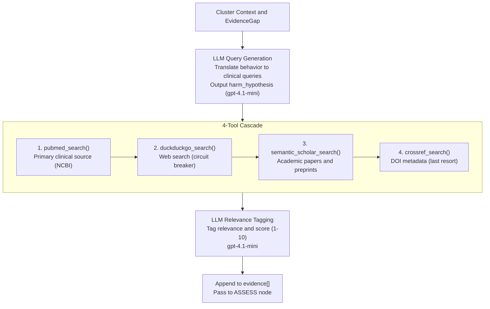

# RESEARCH Node

- **File:** [layers/analysis/nodes/research.py](../../../../../layers/analysis/nodes/research.py) ([research_node](../../../../../layers/analysis/nodes/research.py#L83))
- **Model:** gpt-4.1-mini (two calls per iteration: query generation + relevance tagging)
- **Type:** LLM + tool cascade
- **Runs:** Up to research_retries_left times (max 3) per cluster

## Purpose

Gathers clinical evidence for a cluster. First uses an LLM to translate the social media behavior into its underlying clinical harm mechanism and generate precise medical search queries. Then runs those queries through a fixed 4-tool cascade. Finally uses the LLM again to tag each piece of evidence for relevance and contradiction. Results accumulate across retries.

## Evidence Gathering Flow

## How It Works

### Step 1: LLM Query Generation

The LLM is given the cluster's `search_context`, current `harm_hypothesis` (if a previous retry set one), the current `evidence_gap`, and a list of `prior_queries` it must not repeat.

**Critical instruction:** The LLM must translate the behavior into clinical terminology before searching. Social media vocabulary will never appear in academic literature.

Examples of the required translation:
- `"onion sock for earache"` -> query: `"delayed treatment otitis media complications pediatric"`
- `"ear candling toddler"` -> query: `"ear candling complications case report"`
- `"q-tip challenge ear"` -> query: `"cotton swab tympanic membrane perforation pediatric"`

Output is `ResearchDecision` with up to 2 queries (one per plausible harm mechanism).

If the behavior is clearly benign, the LLM sets `harm_hypothesis = "none - benign content"` and provides a single safety-confirmation query.

### Step 2: 4-Tool Evidence Cascade

For each query, the tools are called in order:

| Step | Tool | Tier | Rate Limit / Notes |
|---|---|---|---|
| 1 | [pubmed_search()](../../../../../layers/analysis/tools/pubmed.py#L69) | `clinical` | Primary target; 3 req/s via NCBI |
| 2 | [duckduckgo_search()](../../../../../layers/analysis/tools/duckduckgo.py#L42) | `web_only` | Skipped if circuit breaker is open |
| 3 | [semantic_scholar_search()](../../../../../layers/analysis/tools/semantic_scholar.py#L29) | `clinical` | Academic fallback |
| 4 | [crossref_search()](../../../../../layers/analysis/tools/crossref.py#L24) | `web_only` | Citation DOI lookup, last resort |

All results are appended to the `evidence` accumulator.

### Step 3: LLM Relevance Tagging

The LLM is given the full list of gathered evidence items and asked to tag each one with:
- `is_relevant`: Does this directly relate to the pediatric ENT behavior?
- `contradicts_harm`: Does this argue the behavior is actually safe?
- `relevance_score`: 1-10 match against the specific harm hypothesis

These tags are written back onto each EvidenceItem in state. The ASSESS node uses them to compute the evidence_score.

### Step 4: harm_hypothesis Propagation

If this is the first RESEARCH run (no existing `harm_hypothesis`), the LLM output becomes the state's `harm_hypothesis`. On retries, the existing hypothesis is preserved and passed back to the LLM as context.

## Retry Behaviour

If ASSESS finds insufficient evidence, it writes an `EvidenceGap` to state and routes back to RESEARCH. RESEARCH checks `evidence_gap` and uses its `suggested_query` and `suggested_tool` to guide the retry. `research_retries_left` is decremented on each retry. When it reaches 0, ASSESS routes to CLASSIFY regardless of the score.

## Input State Fields Read

| Field | Source |
|---|---|
| `search_context` | OBSERVE |
| `harm_hypothesis` | RESEARCH (from prior iteration if retry) |
| `evidence_gap` | ASSESS |
| `evidence` | Accumulator |
| `search_queries` | Accumulator |

## Output State Fields Written

| Field | Value |
|---|---|
| `harm_hypothesis` | Set on first run; preserved on retry |
| `search_queries` | Appended with new queries |
| `evidence` | Appended with new EvidenceItems |
| `tool_errors` | Appended if any API call failed |
