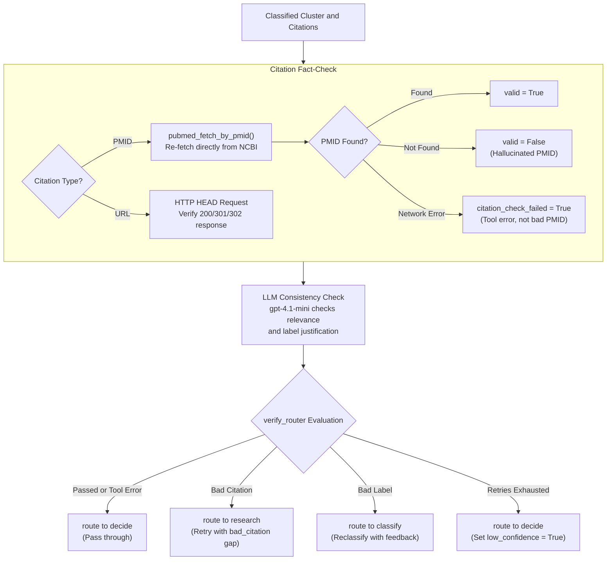

# VERIFY Node

- **File:** [layers/analysis/nodes/verify.py](../../../../../layers/analysis/nodes/verify.py) ([verify_node](../../../../../layers/analysis/nodes/verify.py#L26))
- **Model:** gpt-4.1-mini
- **Type:** LLM + tool (citation lookup)
- **Runs:** After CLASSIFY (and on retry from verify_router if citation fails)

## Purpose

Independent citation fact-checker. Re-fetches each PMID that CLASSIFY cited against the real PubMed database to confirm it exists, then uses an LLM to evaluate whether the citation is actually relevant and whether the label is consistent with the evidence. Catches LLM hallucinations (made-up PMIDs) before they are written to the database.

## Fact-Checking & Routing Logic



## How It Works

### Step 1: PMID Re-fetch

For each citation in `state["citations"]`:
- If the citation has a `pmid`: calls [pubmed_fetch_by_pmid(pmid)](../../../../../layers/analysis/tools/pubmed.py#L105).
  - If the PMID is found -> marks it `valid=True` with the fetched title and snippet.
  - If `PMIDNotFoundError` is raised -> confirmed hallucination, marks it `valid=False`. This triggers the retry route.
  - If the fetch fails due to network/timeout -> marks `check_failed=True` (tool error, NOT a confirmed-bad PMID).
- If the citation has only a URL (web source) -> performs an HTTP HEAD request to verify the URL responds (200/301/302 = accessible).

### Step 2: LLM Relevance and Consistency Check

Given the cluster context (search_context, label, reasoning) and the citation check results, `gpt-4.1-mini` evaluates:

- `citation_relevant`: Do the cited papers actually support the specific claim? Requires topical, population, and context match, not just thematic overlap.
- `label_consistent`: Does the overall evidence justify the assigned label?
- `notes`: Explanation if anything is wrong.

### Output: [VerifyFinding](../../../../../layers/analysis/core/state.py#L25)

```python
class VerifyFinding(TypedDict):
    citation_valid: bool | None       # True/False if checked; None if tool failure
    citation_relevant: bool
    label_consistent: bool
    citation_check_failed: bool       # True = tool failure, not confirmed bad PMID
    notes: str
```

## Routing (via [verify_router](../../../../../layers/analysis/core/routing.py#L38))

| Condition | Next Node |
|---|---|
| `citation_check_failed=True` (tool error) | `decide` (pass through) |
| `citation_valid=False` OR `not citation_relevant` AND `verify_retries_left > 0` | `research` (with bad_citation EvidenceGap) |
| `citation_valid=False` retries exhausted | `decide` with `low_confidence=True` |
| `not label_consistent` AND `verify_retries_left > 0` | `classify` (reclassify) |
| `not label_consistent` retries exhausted | `decide` with `low_confidence=True` |
| All checks pass | `decide` |

Note: `citation_check_failed=True` is not counted as a retry-consuming event. Tool failures do NOT consume `verify_retries_left`.

## Input State Fields Read

| Field | Source |
|---|---|
| `citations` | CLASSIFY |
| `evidence` | RESEARCH accumulator |
| `search_context` | OBSERVE |
| `label` | CLASSIFY |
| `reasoning` | CLASSIFY |
| `verify_retries_left` | State |

## Output State Fields Written

| Field | Value |
|---|---|
| `verify_finding` | VerifyFinding TypedDict |
| `verify_retries_left` | Decremented by 1 (if retrying) |
| `evidence_gap` | Set if routing to research |
