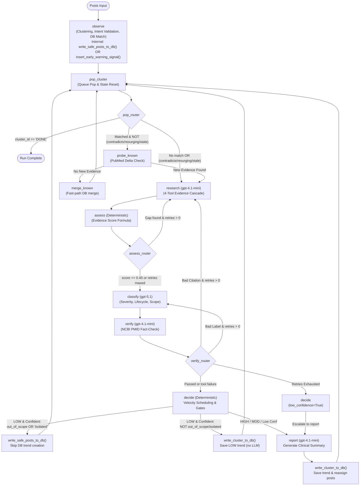

# Analysis Component

- **Location:** [layers/analysis/](../../../../layers/analysis/)
- **Entry point:** [layers/analysis/core/orchestrator.py](../../../../layers/analysis/core/orchestrator.py)
- **Scheduled:** Daily at 12:00 UTC

## Purpose

The most sophisticated layer. Takes all SBERT-passed, unanalysed posts and runs them through a **LangGraph agentic loop** that groups posts into thematic clusters, researches each one against medical databases, classifies each cluster with a risk label and score, and writes the result to the database.

## File Structure

```
layers/analysis/
├── core/
│   ├── orchestrator.py    # Entry point fetches posts, calls run_analysis()
│   ├── graph.py           # StateGraph wiring, pop_cluster, merge_known, route_after_pop
│   ├── state.py           # AgentState TypedDict and all sub-schemas
│   └── routing.py         # route_after_assess, route_after_verify, route_after_decide
├── nodes/
│   ├── observe.py         # SBERT/UMAP/HDBSCAN clustering + LLM intent validation
│   ├── research.py        # LLM query generation + 4-tool evidence cascade
│   ├── assess.py          # Deterministic evidence quality scoring (no LLM)
│   ├── classify.py        # LLM severity/lifecycle/verification classification
│   ├── verify.py          # Citation fact-checking and PMID validation
│   ├── decide.py          # Final label gate + velocity scheduling + DB writes
│   ├── report.py          # LLM summary generation + DB persistence
│   └── probe.py           # PubMed evidence-delta gate for known trends
├── tools/
│   ├── pubmed.py          # PubMed NCBI E-utilities wrapper
│   ├── semantic_scholar.py # Semantic Scholar API wrapper
│   ├── duckduckgo.py      # DuckDuckGo search with circuit breaker
│   ├── crossref.py        # CrossRef DOI lookup
│   └── retry.py           # @with_retry decorator and DuckDuckGoCircuitBreaker
├── db/
│   └── queries.py         # All DB reads and writes for the analysis layer
└── utils/
    ├── cluster_math.py    # SBERT/UMAP/HDBSCAN math and centroid utilities
    ├── batch_cluster_merge.py # Batch cluster merge for known trends
    └── llm.py             # invoke_llm() helper wrapper
```

---

## End-to-End Diagram



---

## Database Persistence & Routing Rules

Not every post or cluster results in a row in the `trends` table. The pipeline optimizes database storage and LLM token costs by categorizing clusters at DECIDE and OBSERVE.

### Persistence Matrix

| Scenario / Cluster State | Node Executing Write | Written to `trends`? | Written to `posts`? | Written to `trend_signals`? | REPORT LLM Called? | Next Node |
|---|---|---|---|---|---|---|
| **HIGH or MODERATE Trend** | REPORT | Yes (`write_cluster_to_db`) | Yes (linked to trend, `gate4_category`) | No | Yes (`gpt-4.1-mini`) | `pop_cluster` |
| **`low_confidence = True` Trend** (any label) | REPORT | Yes (`write_cluster_to_db`) | Yes (linked to trend, `gate4_category`) | No | Yes (`gpt-4.1-mini`) | `pop_cluster` |
| **LOW: Genuine Sustained Trend** (`out_of_scope=False`, not isolated) | DECIDE | Yes (`write_cluster_to_db`) | Yes (linked to trend, `gate4_category='LOW'`) | No | No (bypassed) | `pop_cluster` |
| **LOW: Out of Scope** (`out_of_scope=True`) | DECIDE | **No (SKIPPED)** | Yes (`write_safe_posts_to_db`, marked `'LOW'`) | No | No (bypassed) | `pop_cluster` |
| **LOW: Isolated Incident** (`lifecycle='Isolated incident'`) | DECIDE | **No (SKIPPED)** | Yes (`write_safe_posts_to_db`, marked `'LOW'`) | No | No (bypassed) | `pop_cluster` |
| **Known Fresh Trend (Zero Delta)** | MERGE | Yes (`merge_posts_into_trend`) | Yes (linked to existing trend) | No | No (bypassed) | `pop_cluster` |
| **Noise / Unclassified Posts** | OBSERVE | **No (SKIPPED)** | Yes (`write_safe_posts_to_db`, marked `'LOW'`) | No | No (bypassed) | Never queued |
| **Lone Early-Warning Signal** | OBSERVE | **No (SKIPPED)** | Yes (`write_safe_posts_to_db`) | Yes (`insert_early_warning_signal`) | No (bypassed) | Never queued |
| **Prompt Injection Detected** | OBSERVE | **No (DROPPED)** | No (in-memory discard) | No | No (bypassed) | Never queued |

### Key Routing & Persistence Mechanics

1. **Skipping DB Trend Writes for Discarded Content:**
   - Social media noise that cannot be clustered is marked `gate4_category = 'LOW'` in the `posts` table via [write_safe_posts_to_db()](../../../../layers/analysis/db/queries.py#L485). This prevents re-fetching unprocessed posts in subsequent runs without polluting the `trends` table.
   - When a cluster is evaluated by CLASSIFY as non-ENT (`out_of_scope = True`) or an isolated one-off post (`lifecycle = "Isolated incident"` with <5 posts or 1 platform), DECIDE skips calling `write_cluster_to_db()`. Instead, it only calls `write_safe_posts_to_db()`, ensuring no junk trend row is stored in the database.

2. **The `low_confidence` Escalation Rule:**
   - If VERIFY detects an invalid PubMed citation or a contradiction between the clinical evidence and the assigned severity label, it attempts up to 3 retries.
   - If all retries are exhausted without resolution, the verify router flags `low_confidence = True` and sends the cluster to DECIDE.
   - In [route_after_decide](../../../../layers/analysis/core/routing.py#L82), even if the cluster has `label = "LOW"`, the condition `label == "LOW" and not low_confidence` evaluates to False. The cluster is **forced to escalate to the REPORT node**.
   - This ensures that uncertain or unresolvable medical claims are never silently buried as safe. REPORT calls `gpt-4.1-mini` to document the findings and persists the trend with `low_confidence = True` so human clinicians can audit the conflict.

3. **Bypassing the REPORT LLM for Confident LOW Trends:**
   - A genuine LOW trend that has sustained volume (e.g. widely circulating benign ear-cleaning education) does not require an expensive clinical report summary.
   - DECIDE directly calls [write_cluster_to_db()](../../../../layers/analysis/db/queries.py#L255) with a default placeholder abstract (`"No detailed report generated (LOW risk)."`).
   - It then immediately routes back to `pop_cluster`, saving LLM API tokens and latency.

4. **Fast-Path Merge for Known Trends (`merge_known`):**
   - If OBSERVE matches a cluster to an existing DB trend and PROBE finds zero new PubMed publications since `last_verified_at`, the cluster bypasses RESEARCH, ASSESS, CLASSIFY, VERIFY, DECIDE, and REPORT entirely.
   - The [merge_known_node](../../../../layers/analysis/core/graph.py#L170) calls [merge_posts_into_trend()](../../../../layers/analysis/db/queries.py#L389), which merges the cluster centroid, appends platform tags, updates post counts, and links the posts without invoking any LLM models.

---

## Configurable Constants

| Constant | Value | File | Purpose |
|---|---|---|---|
| `EVIDENCE_THRESHOLD` | `0.45` | [assess.py](../../../../layers/analysis/nodes/assess.py) | Minimum evidence score to skip to CLASSIFY |
| `RESURFACE_GAP_DAYS` | `14` | [graph.py](../../../../layers/analysis/core/graph.py) | Days of inactivity before a trend is treated as resurging |
| `VERDICT_TTL_DAYS` | `30` | [graph.py](../../../../layers/analysis/core/graph.py) | Days before a stored verdict is re-investigated |
| `EW_PROMOTE_THRESHOLD` | `3` | [observe.py](../../../../layers/analysis/nodes/observe.py) | Pending early-warning signals before auto-promotion to a cluster |
| `MERGE_SIMILARITY_THRESHOLD` | `0.98` | [cluster_math.py](../../../../layers/analysis/utils/cluster_math.py) | Cosine similarity to merge two HDBSCAN clusters |
| `EW_SIMILARITY_THRESHOLD` | `0.80` | [cluster_math.py](../../../../layers/analysis/utils/cluster_math.py) | Cosine similarity for grouping early warning signals |
| `CLUSTER_VALIDATION_MAX_WORKERS` | `6` | [observe.py](../../../../layers/analysis/nodes/observe.py) | Max parallel LLM cluster validation threads |
| `PROBE_MAX_RESULTS` | `3` | [probe.py](../../../../layers/analysis/nodes/probe.py) | PubMed results for the evidence-delta check |
| `research_retries_left` | `3` | [state.py](../../../../layers/analysis/core/state.py) | Max RESEARCH retry budget per cluster |
| `verify_retries_left` | `3` | [state.py](../../../../layers/analysis/core/state.py) | Max VERIFY retry budget per cluster |
| `MIN_CLUSTER_SIZE` | `3` | [cluster_math.py](../../../../layers/analysis/utils/cluster_math.py) | Min posts for HDBSCAN to form a valid cluster |
| `MIN_SAMPLES` | `2` | [cluster_math.py](../../../../layers/analysis/utils/cluster_math.py) | HDBSCAN noise tolerance |
| `UMAP_N_COMPONENTS` | `8` | [cluster_math.py](../../../../layers/analysis/utils/cluster_math.py) | UMAP target dimensions |
| `OBSERVE_MATCH_THRESHOLD` | `0.95` | [observe.py](../../../../layers/analysis/nodes/observe.py) | Cosine similarity for matching cluster to existing DB trend (overridable via env) |

## LLM Models

| Node | Model | Notes |
|---|---|---|
| OBSERVE | `gpt-4.1-mini` | Cluster intent validation, concurrent |
| RESEARCH | `gpt-4.1-mini` | Query generation + relevance tagging |
| CLASSIFY | `gpt-5.1` | `reasoning_effort="medium"` |
| VERIFY | `gpt-4.1-mini` | Citation relevance + label consistency |
| REPORT | `gpt-4.1-mini` | Summary generation |

## AgentState Schema

The [AgentState](../../../../layers/analysis/core/state.py#L55) TypedDict ([core/state.py](../../../../layers/analysis/core/state.py)) is the single source of truth for the entire graph:

| Field Group | Key Fields | Purpose |
|---|---|---|
| **Run metadata** | `run_id`, `clusters_queue`, `cluster_results` | Session-level state |
| **Active cluster** | `cluster_id`, `posts`, `trend_name`, `search_context`, `centroid` | Currently processing |
| **Known-trend context** | `matched_trend_id`, `db_trend_label`, `db_trend_risk_score`, `db_trend_last_verified` | Populated by OBSERVE for DB-matched clusters |
| **Research accumulators** | `search_queries`, `evidence[]`, `evidence_gap`, `evidence_score`, `harm_hypothesis` | Append-only across RESEARCH retries |
| **Classification** | `label`, `risk_score`, `lifecycle`, `verification`, `citations[]`, `reasoning` | Set by CLASSIFY |
| **Verification** | `verify_finding`, `tool_degraded`, `low_confidence` | Set by VERIFY |
| **Loop control** | `research_retries_left` (3), `verify_retries_left` (3) | Decremented on each retry |

### Supporting TypedDicts

- **[EvidenceItem](../../../../layers/analysis/core/state.py#L34)**: One piece of evidence: `source`, `source_tier`, `title`, `url`, `pmid`, `snippet`, `is_relevant`, `contradicts_harm`, `relevance_score`
- **[EvidenceGap](../../../../layers/analysis/core/state.py#L12)**: Written by ASSESS: `missing`, `suggested_query`, `suggested_tool`, `reason`
- **[VerifyFinding](../../../../layers/analysis/core/state.py#L25)**: Written by VERIFY: `citation_valid`, `citation_relevant`, `label_consistent`, `citation_check_failed`, `notes`
- **[ToolError](../../../../layers/analysis/core/state.py#L47)**: Logged on API failures: `tool`, `error_type`, `timestamp`, `query`

---

## Node Documentation

The LangGraph pipeline contains both **Pipeline Execution Nodes** (the core analytical, external tool, and LLM reasoning logic in `layers/analysis/nodes/`) and **Graph Orchestration & Queue Helpers** (loop-control functions in `layers/analysis/core/graph.py`).

> [!NOTE]
> **Helper Functions vs. Pipeline Nodes:** While LangGraph's API requires `pop_cluster` and `merge_known` to be registered via `graph.add_node()`, functionally they are **orchestration and database helpers**, not analytical or clinical AI nodes. They perform queue management, state accumulator resets, and deterministic database updates without LLM invocation. In contrast, `probe.py` is in `layers/analysis/nodes/` because it executes an active tool integration call ([pubmed_search](../../../../layers/analysis/tools/pubmed.py)) to query the external NCBI PubMed literature delta over HTTP.

### 1. Pipeline Execution Nodes (`layers/analysis/nodes/`)

| Node | File | Type | Description |
|---|---|---|---|
| OBSERVE | [observe.md](nodes/observe.md) | LLM + Math | SBERT/UMAP/HDBSCAN clustering, LLM intent validation, pgvector DB matching |
| PROBE | [probe.md](nodes/probe.md) | Tool (`pubmed_search`) | PubMed evidence-delta gate; checks for new literature since `last_verified_at` before allowing a silent merge |
| RESEARCH | [research.md](nodes/research.md) | LLM + Tools | Clinical search query generation and 4-tool medical evidence search cascade |
| ASSESS | [assess.md](nodes/assess.md) | Deterministic | Quantitative evidence quality scoring formula and evidence gap detection |
| CLASSIFY | [classify.md](nodes/classify.md) | LLM | High-effort risk severity, affected anatomy, and verification status grading |
| VERIFY | [verify.md](nodes/verify.md) | LLM + Tool | NCBI PMID re-fetch fact-checking, citation validation, and label consistency check |
| DECIDE | [decide.md](nodes/decide.md) | Deterministic | Safety gate, LOW-risk handling, and velocity monitor scheduling rule |
| REPORT | [report.md](nodes/report.md) | LLM + DB | Structured clinical summary generation and database UPSERT |

### 2. Graph Orchestration & Queue Helpers (`layers/analysis/core/graph.py`)

| Helper Function / Node | File | Role | Purpose |
|---|---|---|---|
| `pop_cluster` | [pop_cluster.md](nodes/pop_cluster.md) | Queue Iterator Helper | Pops `queue[0]` off `clusters_queue`, resets research accumulators, and passes the cluster to the router |
| `merge_known` | [merge.md](nodes/merge.md) | Database Bypass Helper | Fast-path zero-LLM database update that increments post counts and merges centroids for known trends |


All external search tools and evidence APIs are documented in [tools.md](tools.md):

| Tool | Module | Source Tier | Description |
|---|---|---|---|
| [PubMed](tools.md#1-pubmed-pubmedpy) | [pubmed.py](../../../../layers/analysis/tools/pubmed.py) | `clinical` | Primary NCBI clinical literature, XML abstracts, and PMID fact-checking |
| [DuckDuckGo](tools.md#2-duckduckgo-duckduckgopy) | [duckduckgo.py](../../../../layers/analysis/tools/duckduckgo.py) | `web_only` | Hospital advisories, FDA safety alerts, and web fallback with circuit breaker |
| [Semantic Scholar](tools.md#3-semantic-scholar-semantic_scholarpy) | [semantic_scholar.py](../../../../layers/analysis/tools/semantic_scholar.py) | `clinical` | Academic preprints, cross-discipline papers, and 1 req/s rate pacing |
| [CrossRef](tools.md#4-crossref-crossrefpy) | [crossref.py](../../../../layers/analysis/tools/crossref.py) | `web_only` | DOI citation lookup and publication metadata via the polite pool |

---

## DB Interactions

All database reads and writes are documented in [database.md](database.md).

---

## Risk Labels

| Label | Meaning | Example |
|---|---|---|
| `HIGH` | Plausible immediate physical harm requiring emergency care | Eardrum perforation from a challenge |
| `MODERATE` | Plausible harm requiring medical follow-up, not life-threatening | Non-sterile substance in ear canal |
| `LOW` | Educational/informational or minimal plausible harm | Anatomy explainer video |

## Verification Statuses

| Status | Meaning |
|---|---|
| `CONFIRMED` | At least one clinical/peer-reviewed paper or authoritative source documents this exact behavior or injury mechanism |
| `PROVISIONAL` | Related evidence exists but doesn't document the specific mechanism |
| `INSUFFICIENT_EVIDENCE` | No meaningful supporting evidence found |

## Log File

`/mnt/data/Ent-Monitor/layers/analysis/analysis.log`
