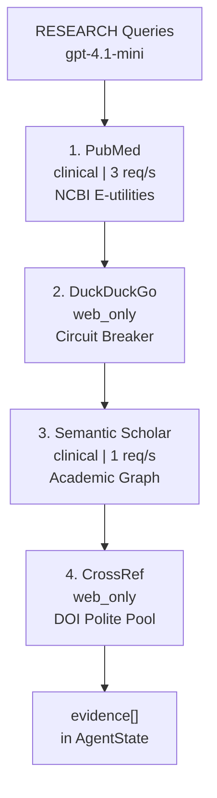

# Analysis Layer Tools & Evidence Cascade

- **Location:** [layers/analysis/tools/](../../../../layers/analysis/tools/)
- **Purpose:** External medical databases, academic APIs, and search engines used by RESEARCH and VERIFY to gather clinical evidence.

## Evidence Cascade Flow

## Tools Comparison Matrix

| Tool | Module | Source Tier | Rate Limit / Pacing | Circuit Breaker | Primary Role |
|---|---|---|---|---|---|
| **PubMed** | [pubmed.py](../../../../layers/analysis/tools/pubmed.py) | `clinical` | 3 req/s (no key) | Retry with backoff | Peer-reviewed clinical evidence and PMID validation |
| **DuckDuckGo** | [duckduckgo.py](../../../../layers/analysis/tools/duckduckgo.py) | `web_only` | Unofficial endpoint | Trips after 3 fails (per-run) | Hospital advisories, FDA notices, emerging web trends |
| **Semantic Scholar** | [semantic_scholar.py](../../../../layers/analysis/tools/semantic_scholar.py) | `clinical` | 1 req/s (2s sleep) | Trips on 429/5xx/timeout | Preprints, cross-discipline papers, academic fallback |
| **CrossRef** | [crossref.py](../../../../layers/analysis/tools/crossref.py) | `web_only` | Polite pool User-Agent | Retry with backoff | DOI citation lookup and publication metadata |

---

## Tool Details

### 1. PubMed ([pubmed.py](../../../../layers/analysis/tools/pubmed.py))

- **Source Tier:** `clinical`
- **Endpoint:** NCBI E-utilities (`https://eutils.ncbi.nlm.nih.gov/entrez/eutils`)
- **Rate Limit:** 3 req/s without API key

#### Why It Is Used
- **Clinical Harm Evidence:** Finds peer-reviewed medical papers and case reports to verify physical harm and justify `CONFIRMED` status.
- **Verification & Delta Checks:** Powers direct PMID fact-checking in VERIFY and date-filtered delta checks in PROBE.

#### Technical Details & Functions
- **[pubmed_search(query, max_results=5)](../../../../layers/analysis/tools/pubmed.py#L69):** Two-step pipeline. Step 1 sends the query to `esearch.fcgi` (sorted by relevance, JSON mode) to retrieve matching PMIDs. Step 2 sends the IDs to `efetch.fcgi` (XML mode) to fetch full abstracts. `_parse_articles()` extracts titles, PMIDs, and abstracts into [EvidenceItem](../../../../layers/analysis/core/state.py#L34) records. Also invoked by [probe_node](../../../../layers/analysis/nodes/probe.py#L35) with date filters (`reldate` or `mindate`) to detect new papers published since `last_verified_at`.
- **[pubmed_fetch_by_pmid(pmid)](../../../../layers/analysis/tools/pubmed.py#L105):** Single-article lookup via `efetch.fcgi`. If NCBI responds cleanly with zero matching articles, it raises `PMIDNotFoundError`. This is a domain signal indicating the citation does not exist, which bypasses retry decorators and propagates directly to VERIFY. Transient network or HTTP errors retry up to 3 times before returning `None`.

### 2. DuckDuckGo ([duckduckgo.py](../../../../layers/analysis/tools/duckduckgo.py))

- **Source Tier:** `web_only`
- **Library:** `ddgs` Python package
- **Rate Limit:** Unofficial endpoint (subject to IP rate throttling)

#### Why It Is Used
- **Regulatory & Hospital Alerts:** Catches FDA safety warnings, CDC alerts, and verified children's hospital notices (Mayo Clinic, Boston Children's).
- **Pre-Trend Coverage:** Surfaces early health warnings issued weeks or months before formal academic studies are published.
- **Viral Context & Slang:** Finds news investigations, trend debunking, and colloquial terms absent from medical literature.

#### Technical Details & Functions
- **[duckduckgo_search(query, max_results=5, tool_errors=None)](../../../../layers/analysis/tools/duckduckgo.py#L42):** Checks the circuit breaker before executing. If closed, calls `_raw_ddg_search()` using `DDGS().text()` and maps results into [EvidenceItem](../../../../layers/analysis/core/state.py#L34) records with `source_tier="web_only"`.
- **Circuit Breaker ([DuckDuckGoCircuitBreaker](../../../../layers/analysis/tools/retry.py#L63)):** Run-level singleton instantiated in the orchestrator and injected via [set_circuit_breaker()](../../../../layers/analysis/tools/duckduckgo.py#L29). Thread-safe with a lock-protected failure counter. Trips automatically after 3 consecutive failures. Once open, all subsequent DDG calls in the run abort immediately with `[]` and log a `circuit_open` [ToolError](../../../../layers/analysis/core/state.py#L47).

### 3. Semantic Scholar ([semantic_scholar.py](../../../../layers/analysis/tools/semantic_scholar.py))

- **Source Tier:** `clinical`
- **Endpoint:** `https://api.semanticscholar.org/graph/v1/paper/search`
- **Rate Limit:** 1 req/s without key (enforced with explicit 2.0s sleep)

#### Why It Is Used
- **Preprints & Adjacent Literature:** Surfaces biomedical preprints (medRxiv, bioRxiv) and cross-domain papers not yet indexed in PubMed.
- **Citation Cross-Validation:** Extracts PMIDs and DOIs to cross-verify papers across academic databases.

#### Technical Details & Functions
- **[semantic_scholar_search(query, max_results=5)](../../../../layers/analysis/tools/semantic_scholar.py#L29):** Requests `title`, `abstract`, `url`, `externalIds`, `year`, and `citationCount`. Enforces an explicit `time.sleep(2.0)` before each request to stay within free-tier rate limits. Automatically constructs `https://doi.org/{doi}` if a direct URL is absent.
- **Circuit Breaker:** A module-level boolean `_CIRCUIT_OPEN` trips immediately upon receiving HTTP 429, 500, 502, 503, 504, or request timeout (15s). Once tripped, all future calls in the run return `[]`. Reset at the start of each run via [reset_circuit_breaker()](../../../../layers/analysis/tools/semantic_scholar.py#L24).

### 4. CrossRef ([crossref.py](../../../../layers/analysis/tools/crossref.py))

- **Source Tier:** `web_only`
- **Endpoint:** `https://api.crossref.org/works`
- **Rate Limit:** Polite pool via User-Agent header

#### Why It Is Used
- **DOI Metadata Resolution:** Pulls clean titles and abstracts for academic papers referenced by DOI in web search results.
- **Polite Pool Access:** Uses a declared contact User-Agent for reliable citation lookups without an API key.

#### Technical Details & Functions
- **[crossref_search(query, max_results=3)](../../../../layers/analysis/tools/crossref.py#L24):** Queries `api.crossref.org/works` selecting `DOI`, `title`, `abstract`, `container-title`, and `author`.
- **Abstract Cleanup:** CrossRef abstracts frequently contain publisher JATS XML markup (such as `<jats:p>`), which is stripped using regex `re.sub(r"<[^>]+>", "", abstract)` before saving to [EvidenceItem](../../../../layers/analysis/core/state.py#L34) snippets. Output items have `pmid=None` and `source_tier="web_only"`.

---

## Shared Retry Infrastructure ([retry.py](../../../../layers/analysis/tools/retry.py))

All tool network calls are wrapped with the [@with_retry](../../../../layers/analysis/tools/retry.py#L31) decorator to absorb transient network glitches:

### Technical Mechanics
- **Exponential Backoff:** Pauses `backoff * (2 ** attempt)` seconds between retries.
- **Parameterized Empty Return:** Defaults to returning `[]` on failure; can be customized (e.g. `empty_return=lambda: None` for single-item lookups).
- **Domain Signal Propagation:** `PMIDNotFoundError` is never caught by `@with_retry`; it propagates directly to callers as an authoritative domain signal.

| Target Function | Max Attempts | Base Backoff | Trigger Exceptions |
|---|---|---|---|
| PubMed (`search` / `fetch`) | 3 | 1.0s exponential | Network timeouts, HTTP errors (except 404) |
| DuckDuckGo (`_raw_ddg_search`) | 3 | 1.0s exponential | Connection errors, rate throttling |
| Semantic Scholar (`search`) | 4 | 3.0s exponential | HTTP 429, 5xx server errors, timeouts |
| CrossRef (`search`) | 3 | 1.0s exponential | Network errors, HTTP 5xx |
