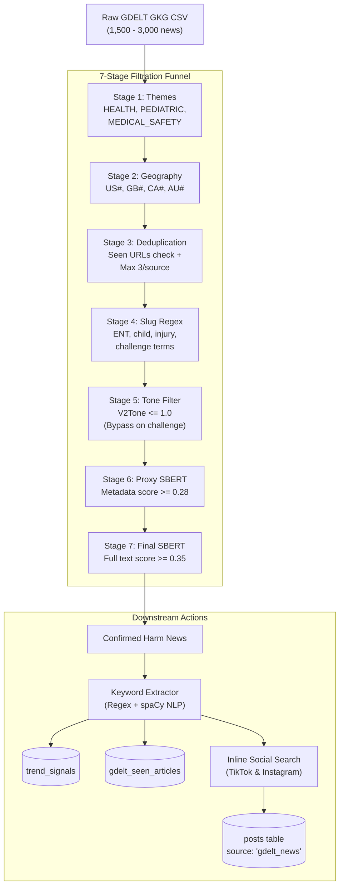
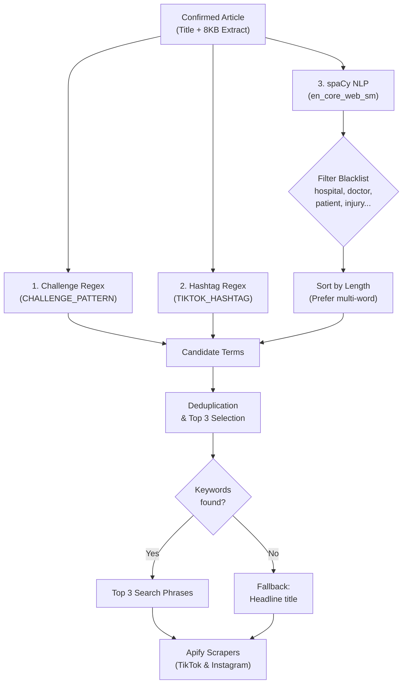

# GDELT News Ingestion & Filtration Funnel

**Location:** `layers/ingestion/news/gdelt.py`  
**Entry point:** `layers/ingestion/orchestrator.py` (`gdelt`)  
**Scheduled:** Daily at `06:00 UTC`

---

## Overview

The GDELT (Global Database of Events, Language, and Tone) ingestion pipeline monitors global news media in near real-time. It detects clinical outcome reports, hospital warnings, pediatric emergency admissions, and regulatory notices related to viral social media hazards.

Because raw GDELT feeds contain thousands of articles across all global events, this component implements a **strict 7-stage cascading funnel** that filters out 99.5%+ of irrelevant news before performing expensive scraping, semantic scoring, and database writes.

## The 7-Stage Funnel Architecture



---

## Step-by-Step Execution Pipeline

### 1. Batch Polling & CDN Propagation
- Calls `poll_gdelt_lastupdate()` to read `http://data.gdeltproject.org/gdeltv2/lastupdate.txt` and find the latest Global Knowledge Graph (`gkg.csv.zip`) URL.
- Checks `get_gdelt_last_polled_url()` in PostgreSQL to prevent re-processing identical batches.
- **CDN 404 Resilience:** GDELT updates `lastupdate.txt` instantly, but file propagation across their CDN takes 2-3 minutes. If `download_and_parse_gkg(url)` encounters an HTTP 404, the script logs a warning and exits cleanly to be retried on the next cycle.

### 2. Funnel Stages Breakdown

The initial stages are orchestrated by `run_preprocessing_funnel(df)`:

#### Stage 1: Coarse Theme Filtering
- Evaluates `V2Themes` column against `HEALTH_THEMES`: `HEALTH`, `MEDICAL`, `TAX_DISEASE`, `TAX_FNCACT_PEDIATRICIAN`, `WB_2319_CHILD_HEALTH`, `MEDICAL_SAFETY`, `SELF_HARM`, etc.
- Drops any article that has no intersection with clinical/health themes.

#### Stage 2: Geographic Relevance
- Checks `V2Locations` against target regions: `US#` (United States), `GB#` (United Kingdom), `CA#` (Canada), and `AU#` (Australia).
- Articles from non-target geographies or irrelevant global locations are eliminated.

#### Stage 3: URL Deduplication & Source Capping
- **Deduplication:** Filters out URLs already present in `get_recent_gdelt_seen_urls()`.
- **Source Capping:** Outlets that syndicate identical wire stories could flood the pipeline. Articles are sorted by absolute tone and limited to the **top 3 most impactful articles per news source** (`groupby("SourceCommonName").head(3)`).

#### Stage 4: URL Slug Keyword Matching
- Extracts the URL path slug (e.g., `hospital-warns-parents-ear-cleaning-trend`).
- Matches against `SLUG_PATTERN`:
  - Anatomy: `ear`, `hearing`, `tonsil`, `nasal`, `nose`, `sinus`, `throat`
  - Demographics: `child`, `infant`, `toddler`, `baby`, `teen`, `pediatric`
  - Hazard signals: `challenge`, `viral`, `trend`, `remedy`, `foreign-body`, `hospital`, `danger`

#### Stage 5: Tone Thresholding
- Evaluates GDELT's `V2Tone` score:
  - Retains articles with negative/critical tone (`tone <= 1.0`).
  - **Bypass Rule:** If the URL slug matches `CHALLENGE_PATTERN` (e.g., `*Challenge`, `*Hack`, `*Dare`) or viral keywords (`tiktok`, `instagram`), the tone check is bypassed so emerging viral warnings are not lost.

#### Stage 6: Batch Proxy SBERT Gate (`threshold = 0.28`)
- Rather than making slow HTTP network requests to scrape hundreds of candidate URLs, `build_proxy_texts(df)` compiles a synthetic **proxy text** from existing metadata:
  ```
  {slug_text}. {top_quotation}. {news_source}. {extracted_entities}
  ```
- `run_proxy_sbert()` evaluates these in bulk against loaded ENT anchor vectors (`fetch_sbert_anchors_with_source()`).
- Only survivors with similarity score `>= 0.28` proceed to full content scraping.

#### Stage 7: Full Content Scraping & Final SBERT (`threshold = 0.35`)
- `fetch_article_content(url)` fetches the live HTML content with a 4-second timeout, streaming only the first **8 KB** to extract the headline `<title>` and first major paragraph `<p>`.
- The extracted text (`{title}. {snippet}`) is embedded with SBERT via `run_final_sbert()`.
- Articles passing the final threshold of `>= 0.35` are confirmed as actionable health hazard news.

### 3. Inline Social Cross-Platform Fetch
When high-confidence clinical news is confirmed, the GDELT pipeline immediately dispatches searches back into social media:
1. Gathers all extracted search terms (e.g., `"magnet piercing"`, `"dry scooping"`).
2. Concurrently calls `scrape_tiktok_search` and `scrape_instagram_search` via Apify (`limit_posts = 5`, `source = 'gdelt_news'`).
3. Scores social videos against SBERT anchors and inserts them directly into the `posts` table.
4. **Result:** A news alert about a child admitted to the ER for an ear challenge immediately pulls in the live TikTok videos driving that exact behavior.

---

## How Keywords Are Extracted from News Articles (GDELT vs Google Trends)

**Implementation:** `extract_search_terms()` in `layers/ingestion/news/gdelt.py:276`  
**Invoked from:** `main()` (gdelt.py:358) once Stage 7 SBERT has confirmed the article is actionable.  
**Inputs:** `article["full_text"]` (title + 300-char body snippet from `fetch_article_content()`) and the loaded `spacy` `en_core_web_sm` pipeline.  
**Output:** Up to 3 lowercase search phrases that look natural when typed into TikTok / Instagram.

### Why GDELT Keyword Extraction is Fundamentally Different

| Aspect | Google Trends (`gtrends.py`) | GDELT News (`gdelt.py`) |
|---|---|---|
| **Data Nature** | Already structured search queries typed by humans | Unstructured journalistic prose & clinical narratives |
| **API Output** | Returns explicit keyword strings (`"ear candling safe"`) | Returns raw article URLs and news body snippets |
| **Extraction Challenge** | None (terms are already search queries; only needs SBERT scoring) | High: must mine 2-4 word colloquial search terms from formal text |
| **Search Engine Usability** | Directly queryable on social media | Full news paragraphs fail on social search; keywords must be mined |

If you passed a full news sentence like *"Doctors at the pediatric hospital issued an alert after treating a 10-year-old child for severe nasal trauma"* into TikTok or Instagram, the search would fail. Social search engines require concise, colloquial phrases or viral challenge tags.

---

### The 3-Tier Keyword Mining Pipeline (`extract_search_terms`)

Once an article passes the 7-stage filter and is confirmed as an ENT harm report, GDELT runs an automated keyword extractor:



### Concrete Extraction Walkthrough

Consider a real clinical news report parsed by the pipeline:

> *"Doctors at Royal Children's Hospital issued an emergency warning after admitting a 12-year-old patient who suffered esophageal perforation. The teenager participated in a viral trend known as the **Magnetic Piercing Challenge**, using **high-powered neodymium magnets** to simulate lip and nasal jewelry as seen in **#fakepiercing** videos..."*

The extraction pipeline breaks this down across three tiers:

1. **Tier 1: Challenge Name Recognition (`CHALLENGE_PATTERN`)**
   - Regex: `(?:the\s+)?([A-Z][a-zA-Z\s]{2,30}(?:Challenge|Trend|Dare|Stunt|Hack|Method|Trick|Remedy|Cure))`
   - Matches: `"Magnetic Piercing Challenge"`
2. **Tier 2: Social Campaign Hashtags (`TIKTOK_HASHTAG_PATTERN`)**
   - Regex: `#([A-Za-z][A-Za-z0-9]{2,40})`
   - Matches: `"fakepiercing"`
3. **Tier 3: spaCy Linguistic NLP (`en_core_web_sm`)**
   - Parses the text grammatically to find noun chunks where `c.root.pos_ == "NOUN"` and not a grammatical stop word.
   - **Domain Blacklist Elimination (`BLACKLIST_TERMS`):** Strips generic medical noise like `"hospital"`, `"doctor"`, `"patient"`, `"teenager"`, `"child"`, `"injury"`, `"warning"`.
   - Remaining candidate chunks: `["neodymium magnet", "nasal jewelry"]`.
   - Sorts by length (preferring longer, more specific multi-word phrases over single words).
4. **Final Selection (Top 3 Keywords):**
   ```python
   ["Magnetic Piercing Challenge", "fakepiercing", "neodymium magnet"]
   ```
5. **Immediate Social Action:**
   These three mined terms are instantly fed into `scrape_tiktok_search` and `scrape_instagram_search` (`limit_posts = 5`, `source = "gdelt_news"`). The system captures the viral videos driving the clinical emergency in near real-time.

---

## Database Persistence: Writing to `trend_signals`

**Implementation:** `write_to_db()` in `layers/ingestion/news/gdelt.py:288`

Once an article passes the funnel and keywords are extracted, it is logged in the `trend_signals` table as a `news_match` rather than directly as a confirmed trend or social post. 

- **Unified Staging:** `trend_signals` acts as the staging area for early warnings. It allows the analysis layer to independently evaluate these alerts and cluster them with social data before officially promoting them to the `trends` table.
- **Granular Tracking:** The system writes **one row per extracted keyword** (instead of one per article). Since a single news story might mention multiple distinct hazards, this ensures each keyword can be tracked and searched on social platforms independently.
- **Deduplication:** The canonical URL is saved to `gdelt_seen_articles` to prevent re-processing identical stories in subsequent polling cycles.
