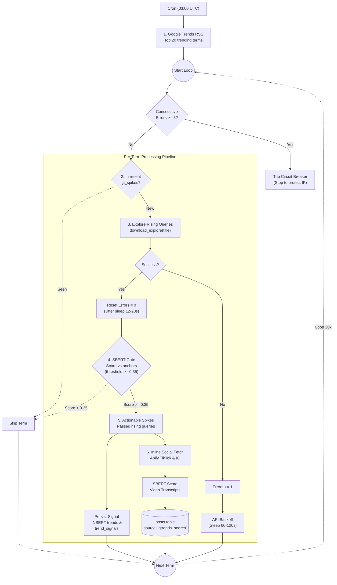

# Google Trends Ingestion

**Location:** `layers/ingestion/search/gtrends.py`  
**Entry point:** `layers/ingestion/orchestrator.py` (`gtrends`)  
**Scheduled:** Daily at `03:00 UTC`

---

## Overview

Unlike standard social scrapers that harvest user timelines, Google Trends serves as a **predictive search anomaly detector** and **reactive social discovery engine**. 

It detects emerging search spikes in the general population, checks whether any rising search queries relate to pediatric ENT health hazards, and if confirmed, immediately triggers **inline cross-platform social searches** on TikTok and Instagram to capture the videos driving the search spike.

## Google Trends Workflow



---

## How Keywords Are Discovered & Filtered

Google Trends uses a multi-tier keyword funnel to isolate real threats from general internet noise:

1. **Macro Discovery (Trending Terms):**
   - Polls `download_google_trends_rss(geo="US", normalize=True)` to extract the top 20 highest-velocity trending topics in the United States over the last 24 hours.
2. **Micro Expansion (Rising Related Queries):**
   - For each unanalyzed trending topic, calls `download_google_trends_explore(title, geo="US")`.
   - Google Trends returns "rising" queries specific phrases experiencing breakout search volume associated with that topic.
   - *Example:* Topic `"magnetic balls"` yields rising queries like `"how to put magnetic balls in nose"` or `"magnetic ball piercing safe"`.
3. **Semantic Keyword Gating (`threshold = 0.35`):**
   - The rising queries are embedded with SBERT (`all-MiniLM-L6-v2`) and compared via cosine similarity against clinical ENT anchor embeddings loaded from PostgreSQL (`fetch_sbert_anchors_with_source()`).
   - Only rising queries scoring `>= 0.35` are retained as actionable.
4. **Keyword Action Trigger:**
   - The filtered, high-scoring rising queries become the exact search terms passed into the downstream Apify social searchers.

> [!NOTE]
> **Contrast with News Ingestion (GDELT):** While Google Trends natively provides pre-formed search queries from user activity, news articles in GDELT consist of unstructured prose. For details on how regex challenge extraction and spaCy linguistic NLP mine search keywords from articles, see [How Keywords Are Extracted in GDELT](gdelt.md#how-keywords-are-extracted-from-news-articles-gdelt-vs-google-trends).

## Step-by-Step Execution Pipeline

### Step 1: Trending Terms Discovery via RSS
Fetches the top 20 trending terms in the US using `download_google_trends_rss(geo="US", normalize=True)` from the `trendspyg` library. Returns search volume and trending keywords (e.g., `"ear candling"`, `"magnetic ball piercings"`).

### Step 2: Anomaly Deduplication
Calls `get_recent_gt_spikes()` against PostgreSQL. Any keyword that was already processed within the past 7 days is skipped to avoid redundant API consumption and duplicate social queries.

### Step 3: Rising Related Queries Exploration
For each unanalyzed trending keyword, queries Google Trends explore endpoints (`download_google_trends_explore(title, geo="US")`). Extracts breakout rising queries associated with the topic.

### Step 4: Rate Limiting, Backoff & Circuit Breaker
Google Trends aggressively throttles automated queries:
- **Jitter Delay:** Enforces a random pause between calls: `asyncio.sleep(random.uniform(12, 20))`.
- **429 Rate-Limit Backoff:** If an HTTP 429 or rate-limit exception occurs, sleeps for `random.uniform(60, 120)` seconds.
- **Circuit Breaker:** Tracks consecutive errors. If 3 consecutive requests fail (`consecutive_failures >= 3`), the loop terminates early to prevent IP blacklisting.

### Step 5: SBERT Semantic Gate (`SBERT_GT_THRESHOLD = 0.35`)
Rising queries are matched against clinical ENT anchors loaded from the database (`fetch_sbert_anchors_with_source()`). Queries with cosine similarity `>= 0.35` pass as potential pediatric ENT threats.

### Step 6: Database Spike Persistence
When a trend passes the semantic gate, it is logged into the `trends` and `trend_signals` tables:
```sql
INSERT INTO trends (trend_id, trend_name, label, risk_score, discovery_source)
VALUES ($1, $2, 'MODERATE', 0.5, 'gtrends_search')
ON CONFLICT DO NOTHING;

INSERT INTO trend_signals (signal_type, signal_data, search_platforms, search_status, linked_trend_id)
VALUES ('gt_spike', $1, '["tiktok","instagram"]'::jsonb, 'pending', $2);
```

### Step 7: Inline Cross-Platform Social Search
If an Apify client is available (`APIFY_TOKEN` configured):
1. Immediately dispatches parallel searches on **TikTok** (`scrape_tiktok_search`) and **Instagram** (`scrape_instagram_search`) querying for the spike term (`limit_posts = 5`).
2. Collects matching video captions and transcriptions.
3. Automatically scores the newly discovered social media videos with SBERT.
4. Inserts them directly into the `posts` table with `source = 'gtrends_search'`.

---

## Configurable Constants

| Constant | Value | Purpose |
|---|---|---|
| `SBERT_GT_THRESHOLD` | `0.35` | Minimum cosine similarity for rising queries to trigger alerts |
| Top Trends Batch | `20` | Maximum RSS terms inspected per run |
| Inter-query Jitter | `12-20s` | Random delay between explore API calls |
| Backoff Duration | `60-120s` | Sleep duration upon receiving an HTTP 429 error |
| Circuit Breaker | `3 failures` | Abort execution after 3 consecutive explore request errors |
| Inline Scrape Limit | `5 posts` | Social posts fetched per platform for detected spike |
