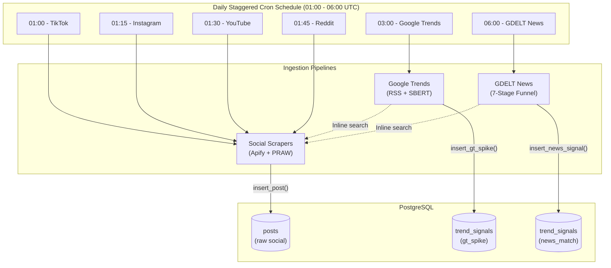

# Ingestion Component Overview

**Location:** `layers/ingestion/`  
**Entry point:** `layers/ingestion/orchestrator.py`  
**Scheduled:** Daily via cron (staggered, 01:00-06:00 UTC)

---

## Purpose

The Ingestion layer collects raw social media posts, search trend anomalies, and clinical news reports from six data sources and writes them into PostgreSQL. 

At this stage, **no deep clinical analysis is performed** social posts are stored with `sbert_score = NULL` (unprocessed) ready for the preprocessing layer, while Google Trends and GDELT act as active discovery engines that can trigger reactive social searches.

## High-Level Architecture

## Ingestion Subsystems

The ingestion pipeline is divided into three distinct mechanisms:

| Subsystem | Target Sources | Method / Tooling | Detailed Documentation |
|---|---|---|---|
| **Social Media** | TikTok, Instagram, YouTube, Reddit | Apify cloud actors, PRAW API + unauthenticated HTTP fallback | [social-media.md](social-media.md) |
| **Search Signals** | Google Trends | `trendspyg` RSS & Explore, SBERT gate, inline cross-platform fetch | [google-trends.md](google-trends.md) |
| **News Stream** | Global News (GDELT) | GKG 2.0 CSV stream, 7-stage filter funnel, spaCy NER, inline fetch | [gdelt.md](gdelt.md) |

---

## Staggered Scheduling Architecture

Ingestion jobs are scheduled sequentially across early morning UTC hours rather than firing simultaneously:

| Time (UTC) | Subsystem | Ingestion Target | Scheduling Rationale |
|---|---|---|---|
| `01:00` | Social Media | TikTok | High-volume video scrape via Apify |
| `01:15` | Social Media | Instagram | Staggered 15 min later to avoid Apify actor concurrency limits |
| `01:30` | Social Media | YouTube | Staggered to isolate browser automation memory spikes |
| `01:45` | Social Media | Reddit | PRAW API and public JSON fallback |
| `03:00` | Search Signals | Google Trends | Analyzes breakout search spikes across last 24h |
| `06:00` | News Stream | GDELT News | 7-stage news filter and reactive cross-platform fetch |

### Why Staggered Execution Is Required
- **Resource Protection:** The backend VM operates with 1.7 GB RAM. Running multiple scrapers simultaneously risks out-of-memory (OOM) termination. Staggering ensures each platform finishes execution and releases memory before the next launches.
- **API Concurrency & Rate Limits:** Staggering avoids concurrent actor charges and rate throttling across external platform endpoints.
- **Pipeline Dependencies:** Social media feeds are fully populated before Google Trends (03:00 UTC) and GDELT (06:00 UTC) execute their inline cross-platform searches.

For the production cron expressions, Linux crontab installation script, and output log file locations, see [Cloud Deployment Guide: Automated Crontab Schedule](../../../setup/cloud.md#automated-crontab-schedule).

---

## Database Operations

The Ingestion layer normalizes all incoming posts into a unified `NormalizedPost` model and writes them into PostgreSQL:
- For the `NormalizedPost` dataclass, raw SQL queries, and parameter bindings, see [Ingestion Database Operations Reference](database.md).
- For complete PostgreSQL table definitions, constraints, and pgvector indexes, see [Database Schema Reference](../../../database/schema.md).
