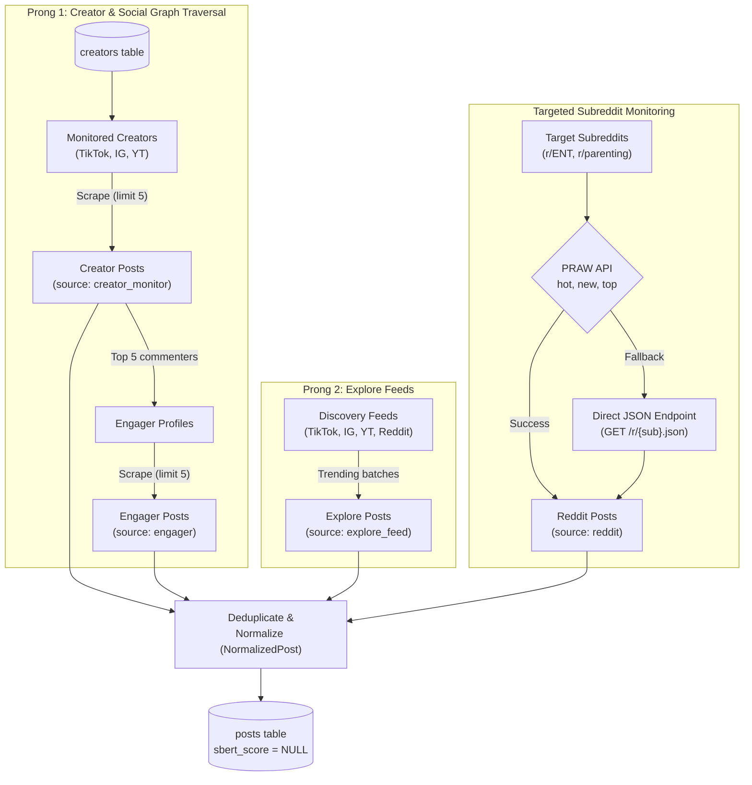

# Social Media Ingestion

**Location:** `layers/ingestion/social/`  
**Files:** `tiktok.py`, `instagram.py`, `youtube.py`, `reddit.py`  
**Entry point:** `layers/ingestion/orchestrator.py`  
**Scheduled:** Daily at `01:00`, `01:15`, `01:30`, and `01:45 UTC`

---

## Overview

Social media ingestion collects posts across four platforms: **TikTok**, **Instagram**, **YouTube**, and **Reddit**. Rather than relying on simple keyword searches, the system combines **creator graph traversal**, **multi-platform explore feeds**, and **resilient community monitoring** to capture emerging pediatric ENT health trends before and as they go viral.

## Architecture & Traversal Strategy



---

## 1. The Two-Pronged Collection Model

For video-first platforms (**TikTok**, **Instagram**, and **YouTube**), content is captured through two complementary paths:

### A. Creator Graph Traversal (Outward Walk)
1. **Seed Accounts:** Active creators are queried from the `creators` table (`fetch_creators_db()`).
2. **Creator Posts:** Scrapes the creator's `limit_posts = 5` most recent uploads.
3. **Engager Discovery:** For each post, extracts top commenters/engagers (`limit_engagers = 5`), filtering out the creator themselves (`handle_set`).
4. **Engager Walk:** Navigates to each discovered commenter's profile and scrapes `posts_per_engager = 5` of their recent posts.
5. **Why this matters:** Dangerous challenges and home remedies typically spread among peer networks before entering mainstream viral algorithms. Walking the social graph detects emerging trends early.

### B. Multi-Platform Explore Feed Ingestion
Independently samples broad discovery and trending feeds across all four platforms (`explore_count = 5` batches) to catch viral anomalies originating outside monitored creator networks:
- **TikTok:** Samples rotating viral exploration hashtags (`fyp`, `foryou`, `trending`, `viral`, `explore`).
- **Instagram:** Samples rotating trending explore tags (`trending`, `explore`, `viral`, `reels`).
- **YouTube:** Queries search endpoints for trending shorts (`trending shorts`, `viral shorts`, `popular shorts`).
- **Reddit:** Samples general community discovery across popular subreddits (`r/popular`, `r/all`, `r/todayilearned`, `r/parenting`, `r/videos`).

## 2. Reddit Ingestion & Resilient Fallback

Reddit ingestion (`layers/ingestion/social/reddit.py`) monitors pediatric, parenting, and ENT discussion forums:

### Primary: PRAW OAuth API
- Authenticates using `REDDIT_CLIENT_ID` and `REDDIT_CLIENT_SECRET`.
- Iterates configured target subreddits (e.g., `r/ENT`, `r/parenting`, `r/toddlers`).
- Fetches submissions across three sorting orders: `hot`, `new`, and `top`.
- Normalizes title, selftext, score, comment count, and permalink into `NormalizedPost`.

### Automated HTTP JSON Fallback
If PRAW encounters an error (authentication expired, API downtime, or rate limiting) or if fewer than `reddit_limit` posts are returned:
- Automatically switches to Reddit's public JSON API endpoint:
  ```
  GET https://www.reddit.com/r/{subreddit}/{sort}.json?limit={reddit_limit}
  ```
- Uses `REDDIT_USER_AGENT` header and a 10-second request timeout.
- Attempts `best`, `hot`, and `new` feeds.
- Seamlessly parses the raw JSON payload (`child['data']`) so scraping never halts due to PRAW SDK failures.

---

## 3. Platform Configurations & Ingestion Constraints

| Platform | Ingestion Engine | Apify Actor / SDK | Target Seeds | Cron Schedule |
|---|---|---|---|---|
| **TikTok** | Apify Cloud Actor | `clockworks/tiktok-scraper` | `@handle` profiles from DB | `01:00 UTC` |
| **Instagram** | Apify Cloud Actor | `apify/instagram-scraper` | Direct profile URLs from DB | `01:15 UTC` |
| **YouTube** | Apify Cloud Actor | `streamers/youtube-scraper` | Channel URLs (`@handle`) | `01:30 UTC` |
| **Reddit** | PRAW + Direct JSON | Native Python SDK + `requests` | Subreddit names from DB | `01:45 UTC` |

### Parameter Constraints:
- `limit_posts = 5`: Recent posts scraped per creator profile.
- `limit_engagers = 5`: Unique commenters extracted per creator post.
- `posts_per_engager = 5`: Recent posts scraped per commenter's profile.
- `explore_count = 5`: Number of explore/trending batches executed per platform.
- `reddit_limit = 50`: Maximum posts fetched per subreddit.
- `downloadSubtitles = True`: Fetches English subtitles for YouTube video transcripts.
- `useApifyProxy = True`: Routes Instagram calls through residential/datacenter proxies to avoid blocks.

## 4. Why the 15-Minute Staggered Timers Matter

The social scrapers run on a staggered crontab:
- **01:00 UTC:** TikTok
- **01:15 UTC:** Instagram
- **01:30 UTC:** YouTube
- **01:45 UTC:** Reddit

**Engineering Rationale:**
1. **Memory Protection:** The backend VM has finite RAM. Apify dataset iteration and concurrent JSON parsing create temporary memory allocations. Staggering ensures each run completes garbage collection before the next begins.
2. **Apify Concurrency Limits:** Running all three Apify scrapers simultaneously would exhaust Apify account actor concurrency limits, resulting in job queuing or timeouts.
3. **Database Write Isolation:** Prevents concurrent locks and connection pool saturation when bulk-inserting raw posts into PostgreSQL.
