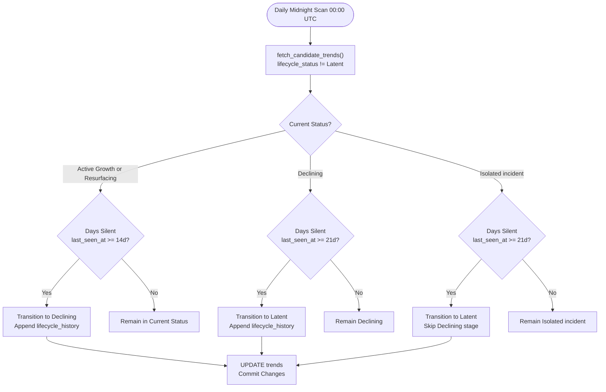

# Lifecycle Monitor

- **File:** [jobs/lifecycle_monitor.py](../../../../jobs/lifecycle_monitor.py)
- **Schedule:** Daily at 00:00 UTC (midnight) via cron
- **Log:** `/mnt/data/Ent-Monitor/jobs/lifecycle.log`
- **Type:** Deterministic batch job (no LLM calls)

## Purpose

Tracks the long-term progression of social media health trends. Runs once daily at midnight to transition inactive or stale trends through lifecycle stages, updating their status and maintaining a chronological audit history.

## Lifecycle Stage Definitions

Trends are classified into one of six distinct lifecycle stages. Classification begins during the daily analysis run (via CLASSIFY) and is updated over time by the Lifecycle Monitor.

| Lifecycle Stage | Qualification Criteria | Description |
|---|---|---|
| **Emergence** | >= 5 posts, >= 2 platforms, age < 7 days | A newly formed trend gaining initial traction across social platforms within its first week of detection. |
| **Growth** | >= 5 posts, >= 2 platforms, age >= 7 days | A sustained trend showing increasing post velocity and active engagement across multiple platforms. |
| **Resurfacing** | Silence gap > 14 days then new activity | A previously tracked trend that went quiet but has re-emerged with fresh social media posts. |
| **Declining** | Silence >= 14 days (or velocity drop for 3 cycles) | An active trend whose social media volume is waning, with zero new posts detected for at least two weeks. |
| **Latent** | Silence >= 21 days from Declining/Isolated | A dormant trend with no recent activity. Remains in the database for historical tracking and resurfacing detection. |
| **Isolated incident** | < 5 posts OR single platform only | A one-off cluster or isolated post that failed to meet the minimum multi-post, multi-platform trend threshold. |

### The Trend Qualification Threshold

Before a cluster can enter the standard growth lifecycle (`Emergence` or `Growth`), it must satisfy the strict trend threshold defined in [classify.py](../../../../layers/analysis/nodes/classify.py#L55):

- **Minimum 5 distinct posts**
- **At least 2 distinct social platforms**

Clusters that fail this threshold are marked `Isolated incident` with `verification = INSUFFICIENT_EVIDENCE`. Because they never experienced a viral growth curve, they cannot enter `Declining`; they transition directly to `Latent` if inactive for 21 days.

---

## State Transition Rules

The Lifecycle Monitor inspects the time elapsed since the trend's last recorded post (`last_seen_at`):



### Transition Thresholds

| Starting Status | Silence Threshold | Next Status | Transition Handler | Rationale |
|---|---|---|---|---|
| `Emergence` | >= 14 days silent | `Declining` | `lifecycle_monitor.py` | Initial spike subsided without sustained viral growth. |
| `Growth` | >= 14 days silent | `Declining` | `lifecycle_monitor.py` | Established trend has stopped generating new content. |
| `Resurfacing` | >= 14 days silent | `Declining` | `lifecycle_monitor.py` | Resurfacing burst was temporary and has quieted down again. |
| `Declining` | >= 21 days silent | `Latent` | `lifecycle_monitor.py` | Two full weeks of decline plus one additional week of zero posts. |
| `Isolated incident` | >= 21 days silent | `Latent` | `lifecycle_monitor.py` | Skips `Declining` because an isolated post never had a rise to decline from. |
| `Declining` or `Latent` | New posts matched | `Resurfacing` | `graph.py` ([pop_cluster](../../../../layers/analysis/core/graph.py#L95)) | Influx of new posts after a > 14 day silence gap reactivates the trend. |

---

## History Audit Trail (`lifecycle_history`)

Every state change is recorded in the trend's PostgreSQL `lifecycle_history` JSONB column. This provides a full chronological audit trail of when the trend emerged, peaked, declined, or resurfaced.

### Data Structure

```json
[
  {
    "date": "2026-08-01T12:00:00+00:00",
    "status": "Emergence"
  },
  {
    "date": "2026-08-15T00:00:00+00:00",
    "status": "Declining"
  },
  {
    "date": "2026-08-22T00:00:00+00:00",
    "status": "Latent"
  },
  {
    "date": "2026-09-10T12:00:00+00:00",
    "status": "Resurfacing"
  }
]
```

---

## Database Operations

### Candidate Query ([fetch_candidate_trends](../../../../jobs/lifecycle_monitor.py#L50))

Fetches all non-dormant trends ordered by the oldest activity first:

```sql
SELECT trend_id, trend_name, lifecycle_status, last_seen_at, lifecycle_history
FROM trends
WHERE lifecycle_status NOT IN ('Latent')
ORDER BY last_seen_at ASC NULLS FIRST
```

### Status Update Query ([update_lifecycle](../../../../jobs/lifecycle_monitor.py#L74))

Updates the status and atomically writes the updated JSONB history array:

```sql
UPDATE trends
SET lifecycle_status = %s,
    lifecycle_history = %s::jsonb
WHERE trend_id = %s
```
