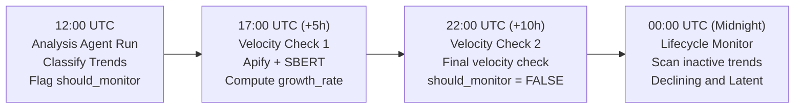

# Monitoring Component

- **Location:** [jobs/](../../../../jobs/)
- **Jobs:** [velocity_monitor.py](../../../../jobs/velocity_monitor.py), [lifecycle_monitor.py](../../../../jobs/lifecycle_monitor.py)
- **Schedule:** 17:00, 22:00, and 00:00 UTC
- **Type:** Standalone batch jobs (no LLM calls)

## Purpose

The Monitoring component tracks the health, spread velocity, and lifecycle progression of ENT health trends over time. Operating independently from the LangGraph analysis loop, these background jobs run via cron to measure real-time social media acceleration and update trend lifecycle stages as interest wanes.

## Monitoring Jobs Overview

| Job | File | Schedule | Primary Role | Detail Doc |
|---|---|---|---|---|
| **Velocity Monitor** | [velocity_monitor.py](../../../../jobs/velocity_monitor.py) | 17:00 & 22:00 UTC | Measures real-time post spread velocity (`posts/h`) via Apify scraping and SBERT centroid matching | [velocity_monitor.md](velocity_monitor.md) |
| **Lifecycle Monitor** | [lifecycle_monitor.py](../../../../jobs/lifecycle_monitor.py) | 00:00 UTC (Midnight) | Transitions stale trends through lifecycle stages (`Emergence` -> `Declining` -> `Latent`) | [lifecycle_monitor.md](lifecycle_monitor.md) |

---

## Daily Execution Timeline

---

## Key Monitoring Responsibilities

### 1. Real-Time Spread Tracking ([velocity_monitor.md](velocity_monitor.md))

- **Velocity Formula:** `growth_rate = len(matched_posts) / 5.0` (expressed in posts per hour).
- **SBERT Verification:** Filters raw Apify social scrapes against the trend's stored 384-dimensional centroid (`similarity >= 0.75`).
- **Bounded Execution:** Each flagged trend is checked strictly twice (at hours 5 and 10), with an automatic 14-day age cutoff.

### 2. Lifecycle Stage Management ([lifecycle_monitor.md](lifecycle_monitor.md))

- **6 Distinct Stages:** `Emergence`, `Growth`, `Resurfacing`, `Declining`, `Latent`, and `Isolated incident`.
- **Trend Threshold:** Requires at least 5 posts across 2 distinct platforms to enter the growth lifecycle; otherwise categorized as `Isolated incident`.
- **Automatic Fading:**
  - Active trends silent for >= 14 days transition to `Declining`.
  - Declining trends silent for >= 21 days transition to `Latent`.
  - Isolated incidents silent for >= 21 days transition directly to `Latent`.
- **Audit History:** Every transition appends an event object into the `lifecycle_history` JSONB column.

For production crontab configuration, cron daemon management, and deployment scripts, see [Cloud Deployment Guide: Automated Crontab Schedule](../../../setup/cloud.md#automated-crontab-schedule).

---

## Database Interactions

All database reads and updates performed by the monitoring jobs interact directly with the `trends` table:

| Operation | Query / Method | Target Table | Purpose |
|---|---|---|---|
| Read Candidates (Velocity) | [fetch_trends_to_monitor()](../../../../layers/analysis/db/queries.py#L609) | `trends` | Retrieves active trends flagged `should_monitor = TRUE` |
| Write Velocity Updates | [update_trend_velocity_monitor()](../../../../layers/analysis/db/queries.py#L652) | `trends` | Updates post count, growth rate, check count, and deactivation flag |
| Read Candidates (Lifecycle) | [fetch_candidate_trends()](../../../../jobs/lifecycle_monitor.py#L50) | `trends` | Fetches all trends where `lifecycle_status NOT IN ('Latent')` |
| Write Lifecycle Transitions | [update_lifecycle()](../../../../jobs/lifecycle_monitor.py#L74) | `trends` | Atomically sets new `lifecycle_status` and appends to `lifecycle_history` |

For the complete schema definition of the `trends` table, including `lifecycle_history`, `velocity_growth_rate`, and `should_monitor`, see [Database Schema: trends](../../../database/schema.md#trends). For the full SQL queries, parameters, and access patterns, see [Monitoring Layer Database Operations](database.md).

