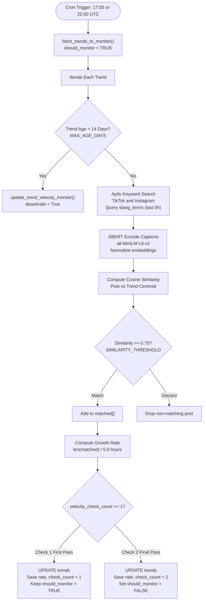

# Velocity Monitor

- **File:** [jobs/velocity_monitor.py](../../../../jobs/velocity_monitor.py)
- **Schedule:** Twice daily at 17:00 UTC and 22:00 UTC
- **Log:** `/mnt/data/Ent-Monitor/jobs/velocity.log`
- **Model:** SentenceTransformers `all-MiniLM-L6-v2` (no LLMs)

## Purpose

Tracks real-time post spread velocity for active high-risk trends. While the main analysis pipeline runs once daily at 12:00 UTC, viral social media trends can accelerate rapidly within hours. The Velocity Monitor checks flagged trends 5 hours later (17:00 UTC) and 10 hours later (22:00 UTC) to quantify viral growth rates.

## Scheduling Criteria (`should_monitor`)

Trends are flagged for velocity tracking by the [decide_node](../../../../layers/analysis/nodes/decide.py#L70) during the daily 12:00 UTC analysis run:

```python
  should_monitor = (
    label == "HIGH"
    or (label == "MODERATE" and (
      lifecycle in ("Emergence", "Growth", "Resurfacing")
      or recent_post_count >= 7
    ))
    or (label == "LOW" and lifecycle in ("Emergence", "Growth") and post_count > 50)
)
```

In addition, [fetch_trends_to_monitor](../../../../layers/analysis/db/queries.py#L609) enforces:
- `slang_terms` must exist and be non-empty (required for Apify social media scraping)
- `centroid` must not be null (required for SBERT cosine similarity matching)
- `last_seen_at` within the last 14 days

---

## Velocity Detection Pipeline



---

## Pipeline Execution Steps

### Step 1: Trend Retrieval & Age Cap

- Calls [fetch_trends_to_monitor()](../../../../layers/analysis/db/queries.py#L609) from the database.
- Evaluates `first_detected_at`. If older than `MAX_AGE_DAYS = 14`, the trend is automatically retired from monitoring to prevent unbounded API spending on stale topics.

### Step 2: Apify Social Scraping

- Calls `keyword_search(keywords=slang_terms, since=5h_ago)`:
  - Invokes [scrape_tiktok_search](../../../../layers/ingestion/social/tiktok.py) and [scrape_instagram_search](../../../../layers/ingestion/social/instagram.py) concurrently via `ApifyClientAsync`.
  - Searches for all `slang_terms` generated by CLASSIFY for that specific trend.
  - Filters posts strictly by timestamp (`posted_at >= now - 5 hours`).

### Step 3: SBERT Centroid Similarity Filter

Keyword search alone on social media yields high noise and false positives. The Velocity Monitor passes all scraped captions through a semantic verification filter:

1. Encodes raw caption text with `SentenceTransformer("all-MiniLM-L6-v2")` to produce 384-dimensional unit vectors.
2. Computes cosine similarity between each post vector and the trend's stored `centroid`:
   ```python
    def _cosine_similarity(a: np.ndarray, b: np.ndarray) -> float:
      return float(np.dot(a, b) / (np.linalg.norm(a) * np.linalg.norm(b)))
   ```
3. Only posts satisfying `_cosine_similarity >= 0.75` (`SIMILARITY_THRESHOLD`) are counted as verified trend activity.

### Step 4: Growth Rate Calculation

The spread velocity is quantified as posts per hour:

```
velocity_growth_rate = len(matched_posts) / hours_elapsed
```

- **`hours_elapsed`:** Fixed at `5.0` hours (the interval between checks).
- **Metric Unit:** Posts per hour (`posts/h`).
- **Interpretation:**
  - `0.0 posts/h`: Activity has completely stalled.
  - `0.2 - 1.0 posts/h`: Moderate sustained spread (1 to 5 verified posts per 5h window).
  - `> 2.0 posts/h`: High viral acceleration (10+ verified posts per 5h window), triggering dashboard escalation.

### Step 5: Two-Check Hard Stop

To bound infrastructure costs and compute overhead, each flagged trend undergoes **strictly two velocity assessments**:

| Check Cycle | UTC Time | Elapsed Since Agent Run | Action | Monitoring State |
|---|---|---|---|---|
| **Check 1** | 17:00 UTC | 5 hours | Computes rate, increments `velocity_check_count = 1` | `should_monitor = TRUE` (active) |
| **Check 2** | 22:00 UTC | 10 hours | Computes rate, increments `velocity_check_count = 2` | `should_monitor = FALSE` (deactivated) |

---

## Database Operations

### Candidate Query ([fetch_trends_to_monitor](../../../../layers/analysis/db/queries.py#L609))

```sql
SELECT trend_id, trend_name, label, slang_terms,
       centroid::text, post_count,
       first_detected_at, velocity_growth_rate, velocity_check_count
FROM trends
WHERE should_monitor = TRUE
  AND slang_terms IS NOT NULL
  AND jsonb_array_length(slang_terms) > 0
  AND centroid IS NOT NULL
  AND label IN ('HIGH', 'MODERATE')
  AND (last_seen_at IS NULL OR last_seen_at >= NOW() - INTERVAL '14 days')
```

### Persistence Query ([update_trend_velocity_monitor](../../../../layers/analysis/db/queries.py#L652))

```sql
UPDATE trends SET
    post_count           = post_count + $1,
    velocity_growth_rate = $2,
    velocity_check_count = velocity_check_count + 1,
    should_monitor       = should_monitor AND NOT $3
WHERE trend_id = $4
```
