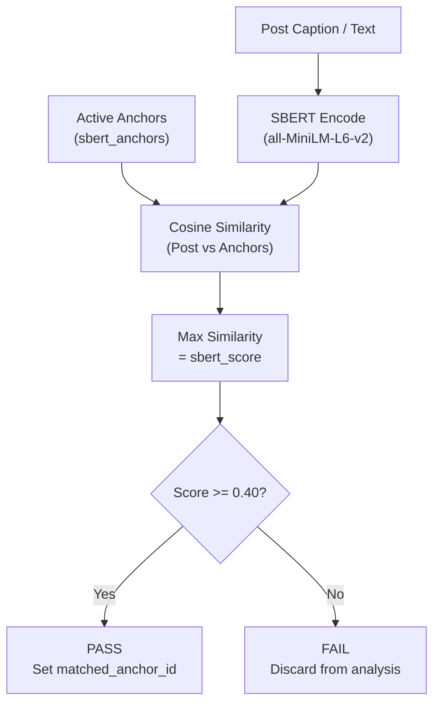

# Preprocessing Component

**Location:** `layers/preprocess/`
**Entry point:** `layers/preprocess/orchestrator.py`
**Scheduled:** Daily at 08:00 UTC

---

## Purpose

Takes every unprocessed post (`sbert_score IS NULL`) and runs it through two sequential gates to determine ENT relevance. After preprocessing, every post has:

- `sbert_score = -1.0` -> Failed quality filter (will never be analysed)
- `sbert_score >= 0.0` -> Scored by SBERT (will be analysed if score >= threshold `0.40`)

---

## File Structure

```
layers/preprocess/
├── orchestrator.py        # Entry point fetches unprocessed posts, runs gates, updates DB
├── filter.py              # Gate 1: Quality filter (language + length)
├── semantic_filter.py     # Gate 2: SBERT cosine similarity vs anchor vectors
└── queries.py             # All SQL queries for preprocessing
```

---

## Step 0: Fetching Unprocessed Data

Before any filtering happens, the orchestrator pulls the raw posts from the PostgreSQL database. 

The absolute strict criteria for pulling a post is:
`WHERE sbert_score IS NULL`

Because `sbert_score` defaults to `NULL` upon ingestion, this guarantees the pipeline only processes brand-new data. 

Once a post is evaluated, it is assigned a concrete numerical score and written back to the database:
- `-1.0`: Hard-assigned if the post fails the Gate 1 Quality Filter (spam, too short, non-English).
- `0.0 to 1.0`: The actual mathematically calculated SBERT cosine similarity score if it reaches Gate 2.

Because no post is ever left as `NULL` after a run, the preprocessing pipeline is perfectly idempotent if it crashes halfway through, rerunning it will simply pick up exactly where it left off without double-processing any posts.

## Gate 1: Quality Filter (`filter.py`)

Fast rule-based rejection of clearly bad posts:

| Check | Condition | Action |
|---|---|---|
| Length | `caption_text` < 3 words | Reject |
| Language | Not detected as English (`langdetect`) | Reject |

Intentionally lightweight only removes garbage. Real relevance filtering happens in Gate 2.

## Gate 2: SBERT Semantic Relevance Filter (`semantic_filter.py`)

### How It Works



1. Load all active anchors from `sbert_anchors WHERE active = TRUE`
2. Encode post's `caption_text` into a 384-dim vector using `all-MiniLM-L6-v2`
3. Compute cosine similarity between the post vector and every anchor vector
4. Post score = **maximum similarity** across all anchors
5. If score >= `SBERT_THRESHOLD` (0.40) -> post passes; `matched_anchor_id` is set to the best-matching anchor

### Anchor System

Anchors are curated semantic reference descriptions of pediatric ENT-harmful behaviors (e.g. *"teenager inserting foreign object into ear canal"* or *"diy ear infection treatment hydrogen peroxide"*).

- **Role:** Each anchor carries a pre-computed 384-dimensional SBERT embedding vector (`all-MiniLM-L6-v2`). During Gate 2, incoming post vectors are scored against active anchors.
- **Seeding & Maintenance:** Anchors are seeded via [002_seed_anchors.py](../../../../database/002_seed_anchors.py). New clinical behaviors can be inserted directly into PostgreSQL with `active = TRUE`, and subsequent preprocessing runs automatically evaluate against them.
- **Authoritative Table Schema:** For full column definitions, types, constraints, and indexes, see [Database Schema: sbert_anchors](../../../database/schema.md#sbert_anchors).

---

## DB Interactions

- For raw SQL queries executed during preprocessing (fetching unprocessed posts, loading active anchors, and writing back SBERT scores), see [Preprocessing Database Interactions](database.md).
- For the complete database schema reference, see [Database Schema Reference](../../../database/schema.md).

---

## Stats Report

At the end of every run, the preprocessor logs a summary:

```
Preprocessing DB Batch
  Input posts:      1,247
  Quality passed:   891
    too short:      312
    non-english:    44
  SBERT scored:     891
  SBERT >= 0.40:    203
  SBERT <  0.40:    688
  By source:
    tiktok:     in=450  quality=310  sbert_pass=98
    instagram:  in=320  quality=228  sbert_pass=62
    youtube:    in=180  quality=148  sbert_pass=30
    reddit:     in=297  quality=205  sbert_pass=13
```

---

## Log File

`/mnt/data/Ent-Monitor/layers/preprocess/preprocess.log`
