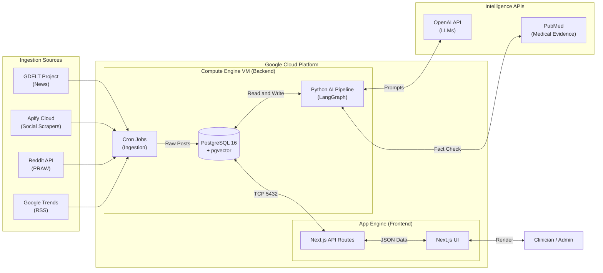
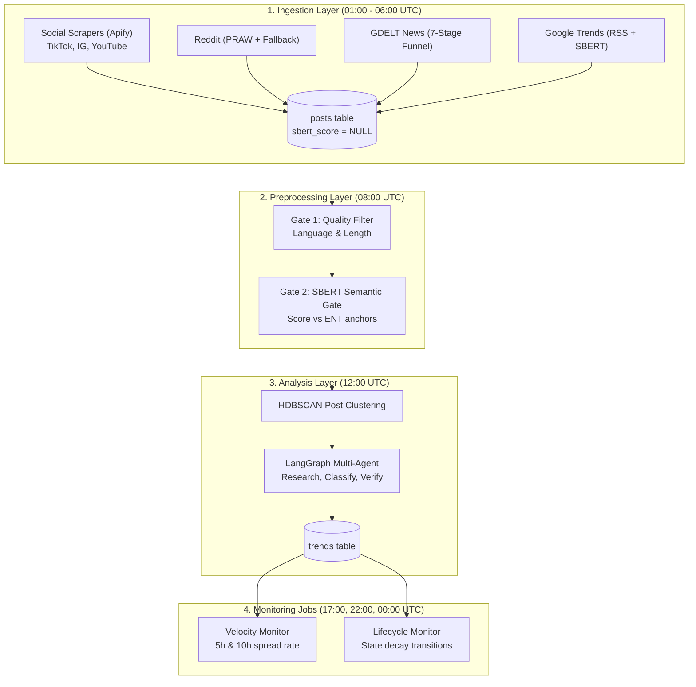

# System Design

## 1. What Is Ent-Monitor?

Ent-Monitor is an automated surveillance system that monitors social media for viral trends that could harm children's ENT (Ear, Nose & Throat) health. It watches for dangerous challenges, unsafe DIY procedures, and health misinformation classifying them by risk level before they spread widely.

**Example threats:**

- "Ear candling" on TikTok promoted as safe ear cleaning
- A YouTube challenge encouraging teenagers to pierce their noses with unsafe tools
- Reddit threads sharing incorrect advice about treating ear infections with hydrogen peroxide

## 2. System Architecture

### Why Two Separate Services?

| Service | Role | Why |
|---|---|---|
| **Compute Engine VM** | Runs all Python ML workloads, scrapers, Docker DB | PyTorch SBERT models need persistent RAM. LangGraph agents run for minutes. Docker volumes need a persistent filesystem. |
| **App Engine** | Serves the Next.js dashboard | Auto-scales to zero when idle (free). Auto-scales up instantly when the medical team opens the dashboard. No VM management. |

### Storage Architecture

| Disk | Size | Mount Path | Purpose |
|---|---|---|---|
| Boot disk | 10 GB | `/` | Linux OS, repository code, and system packages |
| Data disk | 100 GB | `/mnt/data` | PostgreSQL data directory (`postgres_data`), Astral `uv` cache, and logs |

For step-by-step instructions on partitioning, formatting `/dev/sdb`, and persisting the mount across reboots via `/etc/fstab`, see [Cloud Deployment Guide: Format and Mount Data Disk](../setup/cloud.md#format-and-mount-the-data-disk).

### Network Security Boundaries

| Port | Protocol | Purpose | Access Boundary |
|---|---|---|---|
| `22` | TCP | SSH administration | Administrator IPs and Google Cloud Shell |
| `5432` | TCP | PostgreSQL database connection | App Engine frontend dashboard |

For commands to create and inspect these GCP firewall rules, see [Cloud Deployment Guide: GCP Firewall Configuration](../setup/cloud.md#gcp-firewall-configuration).

---

## 3. Pipeline Layers

The system is organized into four sequential layers, each triggered by an automated cron job at a specific UTC time.

### Layer Summary

| Layer | Time (UTC) | Entry Point | Primary Responsibility | LLM? |
|---|---|---|---|---|
| [**Ingestion**](components/ingestion/overview.md) | 01:00-06:00 | [orchestrator.py](../../layers/ingestion/orchestrator.py) | Collects raw posts from 6 data sources into `posts` | No |
| [**Preprocessing**](components/preprocess/overview.md) | 08:00 | [orchestrator.py](../../layers/preprocess/orchestrator.py) | Quality filter and SBERT semantic relevance scoring | No |
| [**Analysis**](components/analysis/overview.md) | 12:00 | [orchestrator.py](../../layers/analysis/core/orchestrator.py) | Groups clusters, researches medical evidence, and classifies risk | Yes (GPT-4.1) |
| [**Monitoring**](components/monitoring/overview.md) | 17:00, 22:00, 00:00 | [velocity_monitor.py](../../jobs/velocity_monitor.py) | Quantifies viral velocity and transitions decaying lifecycle stages | No |

For full crontab configuration, cron daemon commands, and production deployment, see [Cloud Deployment Guide: Automated Crontab Schedule](../setup/cloud.md#automated-crontab-schedule).
