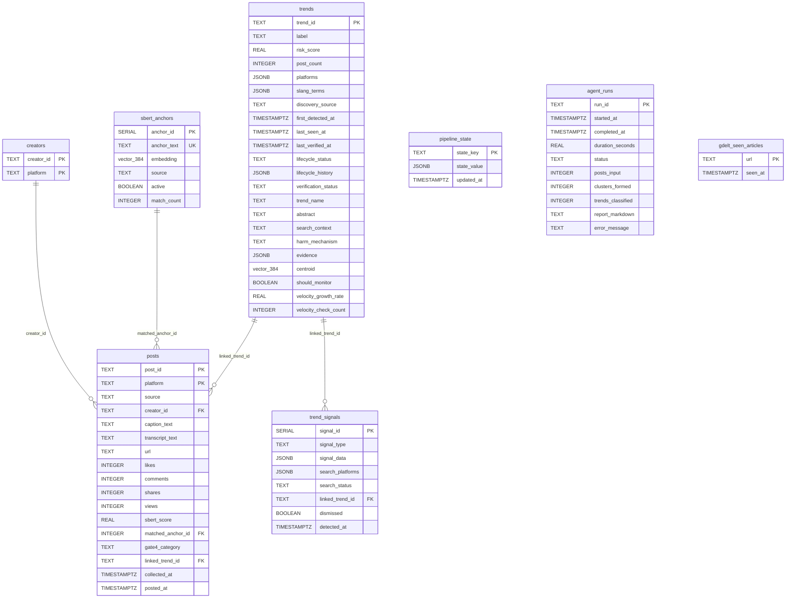

# Database Schema

- **Database:** PostgreSQL 16 with `pgvector` extension  
- **Schema DDL:** [database/001_schema.sql](../../database/001_schema.sql)  
- **Connection URL:** `postgresql://ent_admin:<password>@<VM_IP>:5432/ent_surveillance`
- **Component Database Operations:**
  - [Ingestion Layer Database Operations](../architecture/components/ingestion/database.md)
  - [Preprocessing Database Interactions](../architecture/components/preprocess/database.md)
  - [Analysis Layer Database Operations](../architecture/components/analysis/database.md)

---

## Entity Relationship Overview

---

## Table Reference

### `creators`

Watchlist of social media accounts to monitor.

| Column | Type | Description |
|---|---|---|
| `creator_id` | TEXT PK | Platform-native username or ID |
| `platform` | TEXT PK | `tiktok` \| `instagram` \| `youtube` \| `reddit` |

**Note:** Composite PK on `(creator_id, platform)`. A creator can exist on multiple platforms.

---

### `posts`

Central fact table. Every collected post lives here.

| Column | Type | Description |
|---|---|---|
| `post_id` | TEXT PK | Platform-native unique post ID |
| `platform` | TEXT PK | `tiktok` \| `instagram` \| `youtube` \| `reddit` |
| `source` | TEXT | `creator_monitor` \| `engager` \| `reddit` \| `explore_feed` \| `gtrends_search` \| `gdelt_news` |
| `creator_id` | TEXT | FK to creators |
| `caption_text` | TEXT | Original text caption |
| `transcript_text` | TEXT | Audio/video transcript (YouTube, TikTok) |
| `url` | TEXT | Direct link to source post |
| `likes` / `comments` / `shares` / `views` | INTEGER | Engagement metrics |
| `sbert_score` | REAL | Cosine similarity vs best-matching anchor. `NULL` = unprocessed, `-1.0` = failed quality filter |
| `matched_anchor_id` | INTEGER | FK to sbert_anchors |
| `gate4_category` | TEXT | Risk label from agent: `HIGH` \| `MODERATE` \| `LOW` |
| `linked_trend_id` | TEXT | FK to trends (set after analysis) |
| `collected_at` | TIMESTAMPTZ | When the scraper fetched this post |
| `posted_at` | TIMESTAMPTZ | When the post was published on the platform |

**Indexes:**
- `idx_posts_collected` on `collected_at`
- `idx_posts_linked_trend` (partial) on `linked_trend_id WHERE linked_trend_id IS NOT NULL`

---

### `sbert_anchors`

Semantic reference points used by the SBERT preprocessing filter.

| Column | Type | Description |
|---|---|---|
| `anchor_id` | SERIAL PK | Unique auto-incrementing ID for the semantic anchor |
| `anchor_text` | TEXT UK | Curated behavioral description (e.g., _"inserting cotton swabs deep into ear canal"_) |
| `embedding` | vector_384 | Pre-computed SBERT embedding of anchor_text |
| `source` | TEXT | `manual` (primary behavioral definitions for social media & search trends) \| `news_outcome` (used for new articles in GDELT filter) |
| `active` | BOOLEAN | Whether this anchor participates in filtering |
| `match_count` | INTEGER | Cumulative posts that matched this anchor |

**Index:** `idx_anchors_active` (partial, `WHERE active = TRUE`) for fast filtering scans.

---

### `trends`

The core output table. One row per identified and classified trend.

| Column | Type | Description |
|---|---|---|
| `trend_id` | TEXT PK | Stable slug (e.g., `ear-candling-tiktok`) |
| `label` | TEXT | `HIGH` \| `MODERATE` \| `LOW` |
| `risk_score` | REAL | `0.0` to `1.0` computed risk score |
| `post_count` | INTEGER | Total posts linked to this trend |
| `platforms` | JSONB | Distinct platforms this trend appears on (e.g., `["tiktok", "instagram"]`) |
| `slang_terms` | JSONB | Alternative names and hashtags: `["#earcandling", "ear candle"]` |
| `discovery_source` | TEXT | How the trend was initially discovered (e.g., `gdelt_news`, `explore_feed`) |
| `first_detected_at` | TIMESTAMPTZ | Timestamp when the trend was first promoted and created |
| `last_seen_at` | TIMESTAMPTZ | Timestamp of the last post linked to this trend |
| `last_verified_at` | TIMESTAMPTZ | When the agent last ran a full classification (fast-path merges do NOT refresh this) |
| `lifecycle_status` | TEXT | `Emergence` \| `Growth` \| `Resurfacing` \| `Declining` \| `Latent` \| `Isolated incident` |
| `lifecycle_history` | JSONB | Array of `{date, status, post_count}` transition events |
| `verification_status` | TEXT | `CONFIRMED` \| `PROVISIONAL` \| `INSUFFICIENT_EVIDENCE` |
| `trend_name` | TEXT | Short 4-5 word human-readable name |
| `abstract` | TEXT | LLM-generated clinical summary |
| `search_context` | TEXT | Contextual search terms for the agent to query academic data |
| `harm_mechanism` | TEXT | Clinical mechanism of harm extracted by the LLM |
| `evidence` | JSONB | Array of supporting academic citations |
| `centroid` | vector_384 | SBERT centroid for cross-run cluster matching |
| `should_monitor` | BOOLEAN | `TRUE` for HIGH/MODERATE trends being velocity-tracked |
| `velocity_growth_rate` | REAL | Posts/hour growth rate (+ve = rising, -ve = falling) |
| `velocity_check_count` | INTEGER | Number of times velocity monitor has checked this (max 3) |

**Index:** `idx_trends_centroid` using HNSW with `vector_cosine_ops` enables fast approximate nearest-neighbour search for cross-run cluster matching.

**Constraints:**
- `chk_trends_label`: label IN ('HIGH', 'MODERATE', 'LOW')
- `chk_trends_lifecycle`: lifecycle_status IN ('Emergence', 'Growth', 'Resurfacing', 'Declining', 'Latent', 'Isolated incident')
- `chk_trends_verification`: verification_status IN ('CONFIRMED', 'PROVISIONAL', 'INSUFFICIENT_EVIDENCE')

---

### `trend_signals`

Unverified early-warning signals before they accumulate enough evidence to become full trends.

| Column | Type | Description |
|---|---|---|
| `signal_id` | SERIAL PK | Unique auto-incrementing ID for the signal |
| `signal_type` | TEXT | `news_match` \| `gt_spike` \| `early_warning` |
| `signal_data` | JSONB | Raw forensic signal payload |
| `search_platforms` | JSONB | Target platforms for the cross-platform fetch |
| `search_status` | TEXT | Current processing status (`pending`, etc) |
| `linked_trend_id` | TEXT FK | FK to trends (after promotion) |
| `dismissed` | BOOLEAN | Manually dismissed by clinician |
| `detected_at` | TIMESTAMPTZ | Timestamp when the signal was discovered |

When `EW_PROMOTE_THRESHOLD = 3` signals of the same behavior accumulate, they are promoted to a full cluster in the next analysis run.

---

### `agent_runs`

Execution log for every LangGraph analysis session.

| Column | Type | Description |
|---|---|---|
| `run_id` | TEXT PK | Timestamped slug (e.g., `run_20260901_120000`) |
| `started_at` | TIMESTAMPTZ | Timestamp when the agent run started |
| `completed_at` | TIMESTAMPTZ | Timestamp when the agent run completed |
| `duration_seconds` | REAL | Total duration of the run in seconds |
| `status` | TEXT | `running` \| `completed` \| `failed` \| `timeout` |
| `posts_input` | INTEGER | Posts fed to OBSERVE |
| `clusters_formed` | INTEGER | Clusters produced by OBSERVE |
| `trends_classified` | INTEGER | Trends written to DB this run |
| `report_markdown` | TEXT | Auto-generated session summary |
| `error_message` | TEXT | Set if status = `failed` |

---

### `pipeline_state`

Generic key-value store for pipeline workers to persist their last checkpoint.

| Key | Value | Purpose |
|---|---|---|
| `state_key` | TEXT PK | Key name for the pipeline state item (e.g., `gdelt_poll`) |
| `state_value` | JSONB | The persistent JSON payload |
| `updated_at` | TIMESTAMPTZ | Timestamp of the last time this state was updated |

---

### `gdelt_seen_articles`

Simple URL deduplication table for the GDELT news worker.

| Column | Type | Description |
|---|---|---|
| `url` | TEXT PK | Canonical article URL |
| `seen_at` | TIMESTAMPTZ | Timestamp the article was ingested (used for 48-hour pruning TTL) |

---

## Related Documentation

- [System Design Architecture](../architecture/system-design.md): System topology and end-to-end data flow.
- [API Endpoints Reference](../api/endpoints.md): HTTP routes querying the database for the frontend dashboard.
- [Local Development Setup Guide](../setup/local.md): Running Docker PostgreSQL and seeding initial data locally.
- [Cloud Deployment Guide](../setup/cloud.md): Persistent disk setup, VM Docker database deployment, and post-reboot recovery.
